# Portal de Egressos

**Formação, trajetórias e conquistas em uma comunidade conectada.**

Aplicação web para aproximar a comunidade acadêmica de seus egressos. Reúne perfis
públicos, formação, experiências profissionais e relatos, com ferramentas para
coordenadores acompanharem cursos e publicarem conquistas.

Desenvolvido como projeto de portfólio full stack, com interface em React, API
Java/Spring Boot e persistência em PostgreSQL.

**React 19 · Java 17 · Spring Boot 3.4 · PostgreSQL 16 · Docker Compose**

[Executar a demonstração](#executar-a-demonstração) · [Funcionalidades](#funcionalidades) · [Galeria completa](#principais-telas) · [Arquitetura](#arquitetura-e-modelo-de-dados) · [Guia técnico](#guia-de-execução-e-configuração)

## Visão do portal


| Perfil público | Meu espaço | Coordenação de curso |
| --- | --- | --- |
| 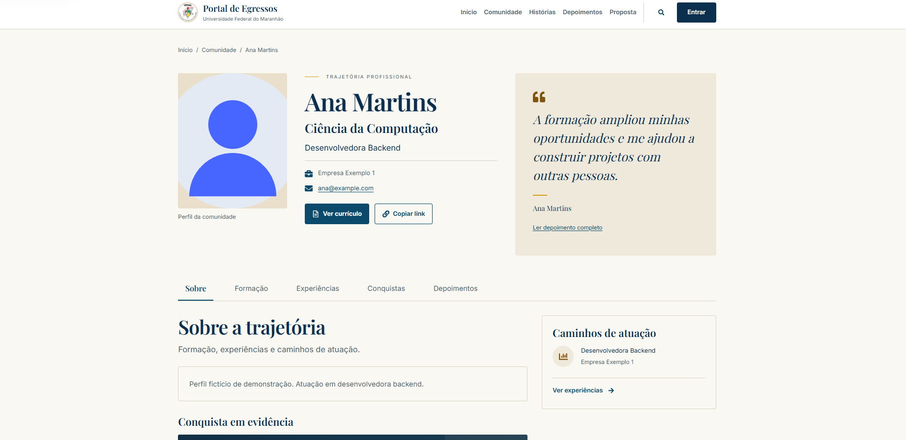 | 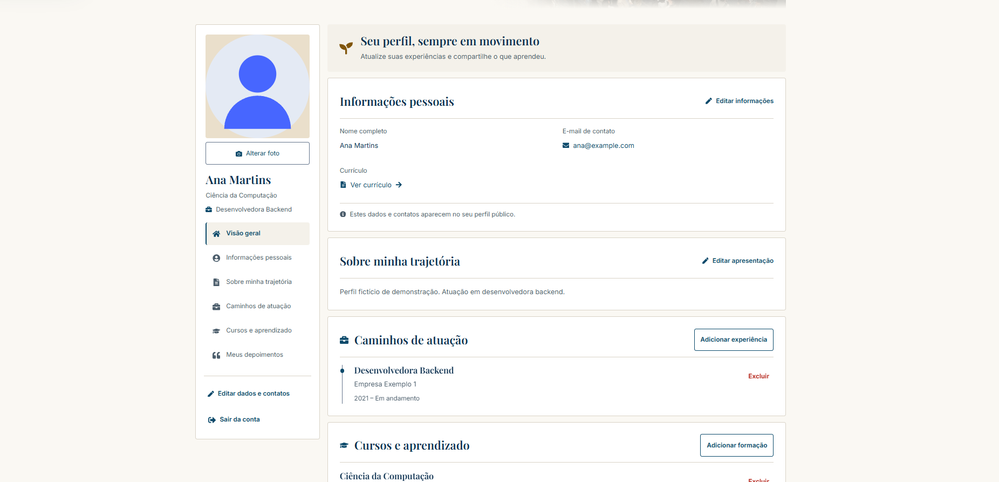 | 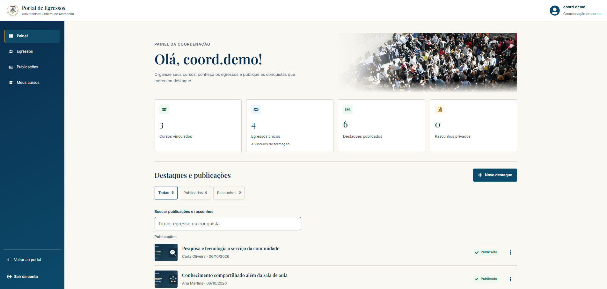 |
| [Conhecer uma trajetória](#perfil-público-do-egresso) | [Atualizar o próprio perfil](#meu-espaço) | [Acompanhar e publicar conquistas](#painel-do-coordenador-de-curso) |

As imagens mostram a aplicação em execução com dados fictícios. A
[galeria completa](#principais-telas) reúne as partes de cada tela, os formulários,
a administração geral e as versões mobile.

## Executar a demonstração

Com **Git** e **Docker com Compose v2.20+** instalados, inicie o Docker e execute:

```bash
git clone https://github.com/ucasabreu/app_portal_egresso.git portal-egressos
cd portal-egressos
docker compose up --build -d --wait --wait-timeout 240
```

Abra **[http://localhost:5173](http://localhost:5173)** após os serviços ficarem
saudáveis. A API e o banco de exemplo são preparados pelos containers; nesse modo,
não é necessário instalar Java, Node ou PostgreSQL na máquina.

As portas padrão **5173** e **8080** precisam estar livres. A primeira execução
baixa imagens e dependências. Para usar outras portas, consulte
[executar junto a outros projetos](#executar-junto-a-outros-projetos).

### Experimentar os diferentes perfis

Em **[Entrar](http://localhost:5173/login)**, utilize uma das contas abaixo.
A senha pública de demonstração é **`demo123`**.

| Conta | Login | O que explorar |
| --- | --- | --- |
| Egresso | `ana@example.com` | Meu espaço, edição em três etapas, formação, experiências e depoimentos. |
| Coordenador de curso | `coord.demo` | Egressos por curso, publicações, editor de destaques e rascunhos. |
| Coordenação geral | `admin.demo` | Contas de coordenação, cursos e seus responsáveis. |

Para abrir o navegador e acompanhar os logs automaticamente, use
[`iniciar.cmd`](iniciar.cmd) no Windows ou `bash iniciar.sh` no Linux/macOS/WSL.
Os detalhes estão em [inicializadores por sistema](#inicializadores-por-sistema).

Para encerrar o ambiente, preservando os dados:

```bash
docker compose down
```

O [guia de execução e configuração](#guia-de-execução-e-configuração) inclui as
demais contas demo, portas alternativas, desenvolvimento local e restauração do banco.

## Funcionalidades

| Quem utiliza | Experiência no portal |
| --- | --- |
| **Visitante** | Explora a comunidade, filtra egressos por formação e experiência, conhece perfis, lê depoimentos e acompanha conquistas. |
| **Egresso** | Atualiza foto, apresentação e contatos; registra formação, experiências e relatos; confere os dados antes de salvar. |
| **Coordenador de curso** | Acompanha os egressos dos seus cursos, consulta publicações e prepara destaques com prévia e rascunhos privados. |
| **Coordenação geral** | Administra contas e cursos, atribui responsáveis e gerencia perfis e publicações conforme suas permissões. |

<details>
<summary>Consultar os recursos de cada área e as regras dos formulários</summary>

| Área | O que é possível fazer |
| --- | --- |
| Página inicial | Descobrir conquistas publicadas, conhecer até seis pessoas da comunidade e ler até três depoimentos recentes. |
| Consulta de egressos | Explorar cartões com formação e experiência, pesquisar por nome/curso/cargo/anos, remover filtros, ordenar e paginar; compartilhar a consulta e retomá-la ao voltar de um perfil. |
| Perfil do egresso | Consultar apresentação, foto, formação, experiências e conquistas; acessar currículo, redes e copiar o link do perfil. |
| Cadastro e edição | Criar uma conta de egresso com senha e preencher identificação, apresentação e contatos em três etapas, conferir os dados e salvar; receber avisos ao sair com alterações não salvas. |
| Trajetória acadêmica e profissional | Registrar formação, experiência e depoimentos com validação e revisão antes de salvar; indicar períodos em andamento. |
| Depoimentos | Registrar relatos, ler textos longos com expansão, pesquisar por ano e compartilhar a consulta. |
| Destaques | Buscar por egresso ou curso, ordenar por data e abrir cada publicação; explorar o histórico por ano e cadastrar, editar ou retomar rascunhos de destaques pelo painel de coordenação. |
| Coordenação de curso | Pesquisar cursos, egressos e publicações; salvar rascunhos privados, conferir a prévia de um destaque antes de publicar e desvincular uma formação preservando o perfil. |
| Coordenação geral | Pesquisar contas e cursos por responsável, criar contas de coordenação, editar cursos e seus responsáveis, definir acesso para perfis existentes e confirmar exclusões com identificação do registro. |

Fotos de perfil e imagens de destaque enviadas por arquivo aceitam **JPEG, PNG
ou WebP, até 2 MB por imagem**. A API valida o tamanho após decodificar o base64
e a assinatura do formato. Também aceita URLs HTTP(S), limitadas a 2.048
caracteres, e caminhos locais como `/demo/avatar.svg`; a disponibilidade de
imagens externas depende do servidor de origem.

Os formulários preservam o conteúdo quando a gravação falha e avisam sobre
alterações não salvas. No editor de destaques, **Salvar rascunho** grava no banco
para recuperar pela mesma conta após recarregar ou acessar outra máquina.
Campos ainda não salvos e formulários de perfil, formação e curso permanecem
somente na aba aberta; não há salvamento automático.

</details>

## Diferenciais técnicos

| Implementação | Resultado para o usuário e para o projeto |
| --- | --- |
| **Interface compartilhada** | Componentes reutilizáveis, tokens de estilo e telas adaptadas a desktop e celular, com estados distintos de carregamento, erro e ausência de registros. |
| **Formulários em etapas** | Prévia e revisão antes de gravar, validação dos campos, preservação do rascunho na falha e aviso ao sair sem salvar. |
| **Sessão e permissões na API** | Sessões no servidor, cookies HttpOnly, proteção CSRF e verificação de papel e propriedade dos registros nas operações protegidas. |
| **Consultas paginadas** | Filtros, ordenação e paginação no backend; cartões de egressos com formações e cargos carregados em lote. |
| **Publicações com rascunhos persistidos** | Continuação da edição após recarregar ou trocar de máquina; controle de versão e publicação transacional. |
| **Ambiente reproduzível** | Docker Compose com dados de exemplo, verificações de saúde e volume persistente; inicializadores por sistema e automação de validação no GitHub Actions. |

As responsabilidades estão distribuídas entre componentes e serviços no frontend,
controllers, DTOs, regras de negócio e repositórios no backend.

## Principais telas

Capturas da aplicação em execução com dados fictícios de demonstração. As telas
estão organizadas por funcionalidade, com as partes de cada página na sequência
de leitura. Expanda os grupos para consultar os formulários, painéis e versões mobile.

### Página inicial

Apresentação do portal, acesso à comunidade e conquistas publicadas pela coordenação.

<details>
<summary>Ver a apresentação e o carrossel de conquistas</summary>

#### 1. Apresentação e acesso ao portal


#### 2. Conquistas da comunidade

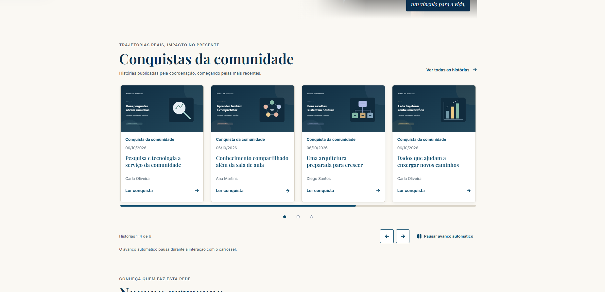

</details>

### Comunidade

Consulta pública de egressos com busca, filtros por formação e experiência, ordenação e acesso aos perfis.

<details>
<summary>Ver pesquisa, filtros e cartões de egressos</summary>

#### Pesquisa e resultados

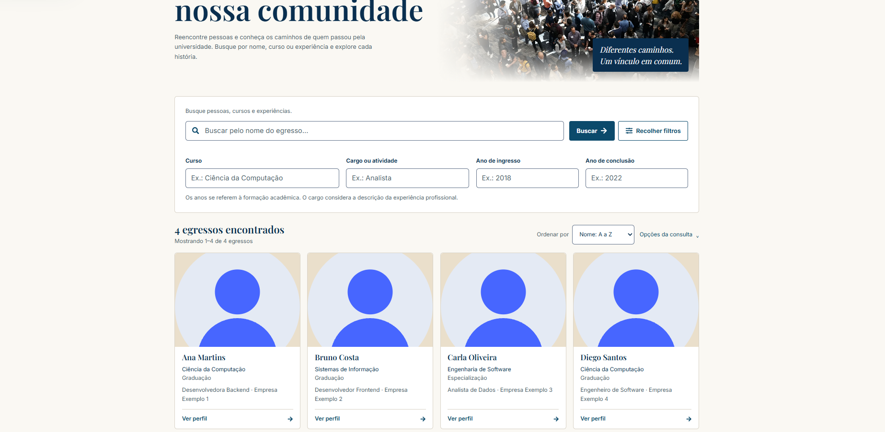

</details>

### Perfil público do egresso

Identificação, contatos e apresentação reunidos com formação, experiências, conquistas e depoimentos.

<details>
<summary>Ver as 3 partes do perfil público</summary>

#### 1. Identificação, contatos e apresentação


#### 2. Conquista em evidência e início da trajetória

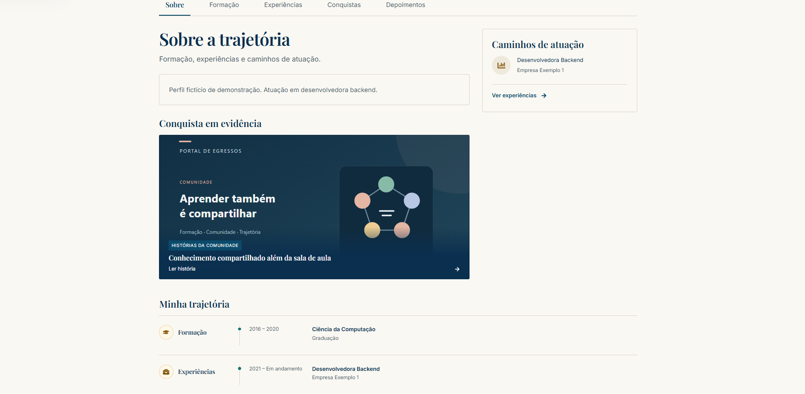

#### 3. Formação, experiências, conquistas e depoimentos

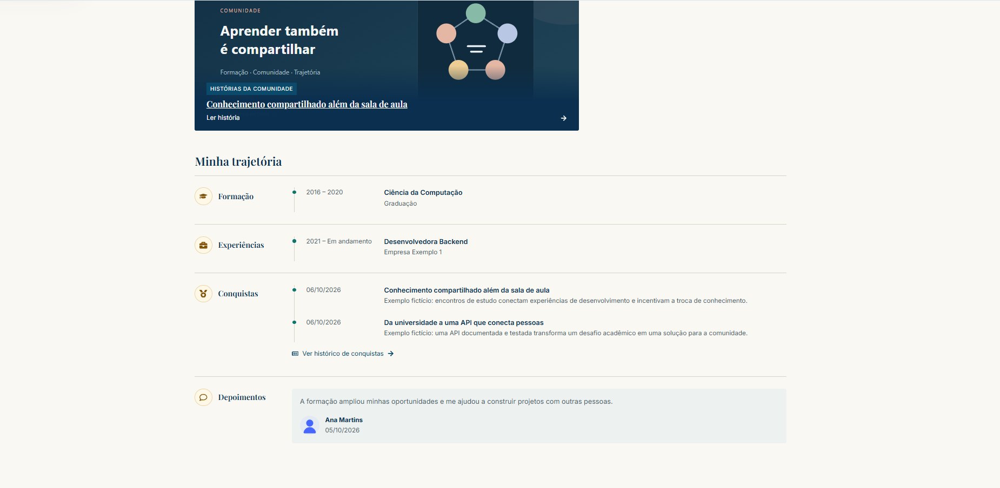

</details>

### Meu espaço

Área do egresso para atualizar seus dados e registrar experiências, formação e relatos.

<details>
<summary>Ver a visão geral e os formulários do egresso</summary>

#### 1. Visão geral, informações pessoais e apresentação


#### 2. Registro de experiência profissional

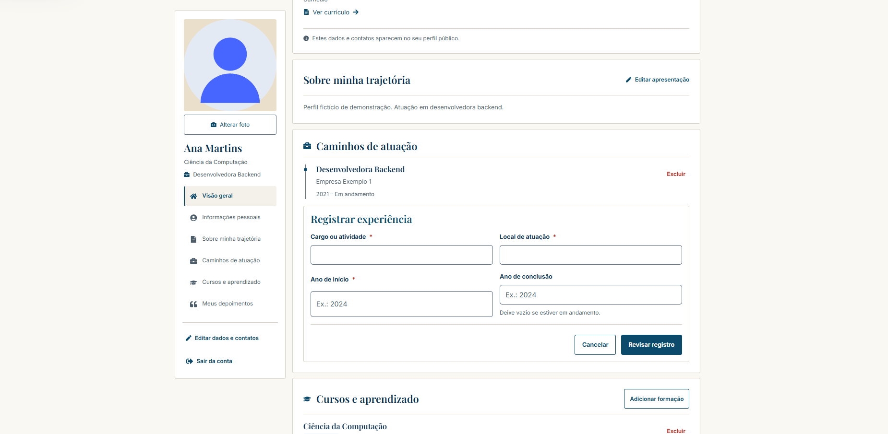

#### 3. Formação e compartilhamento de depoimentos

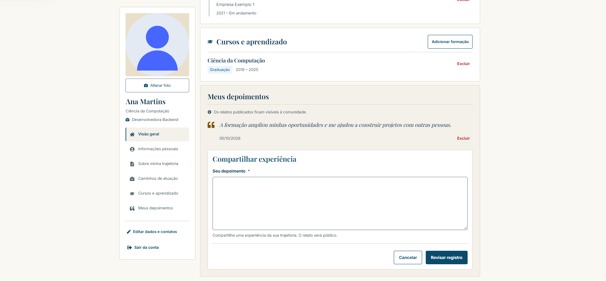

</details>

### Edição do perfil em três etapas

Prévia do perfil ao lado do formulário, com identificação, apresentação e revisão antes de salvar.

<details>
<summary>Ver identificação, apresentação e revisão</summary>

#### 1. Identificação

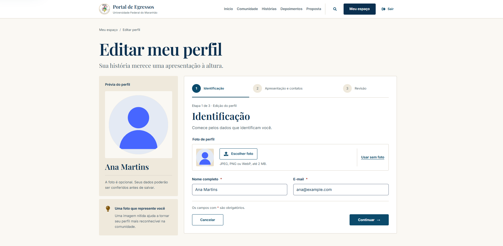

#### 2. Apresentação e contatos

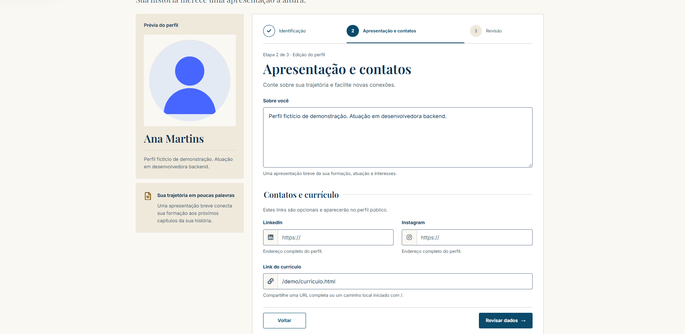

#### 3. Revisão e confirmação

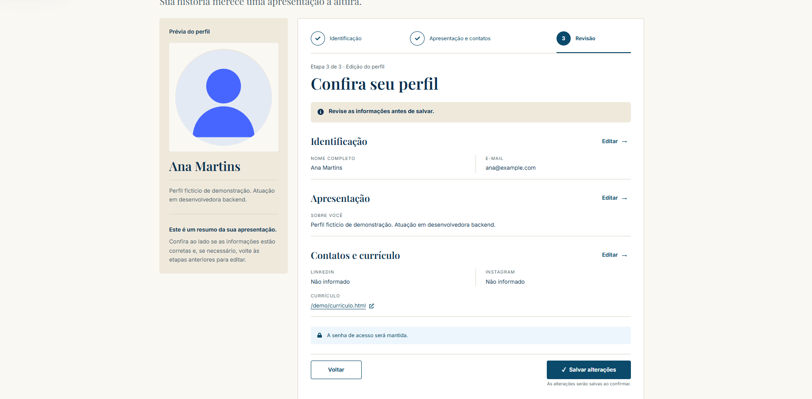

</details>

### Histórias e conquistas

Publicações associadas aos egressos, com capa, notícia, acesso à trajetória e compartilhamento.

<details>
<summary>Ver uma publicação de destaque</summary>

#### Publicação e trajetória associada

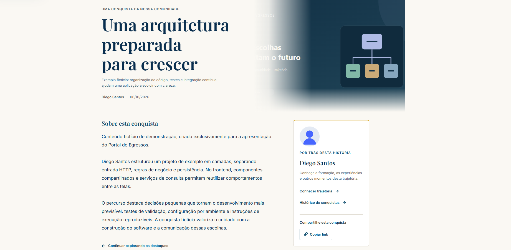

</details>

### Depoimentos da comunidade

Relatos sobre a formação, organizados por data e pesquisáveis por ano.

<details>
<summary>Ver a consulta e os relatos publicados</summary>

#### Pesquisa por ano e leitura dos relatos

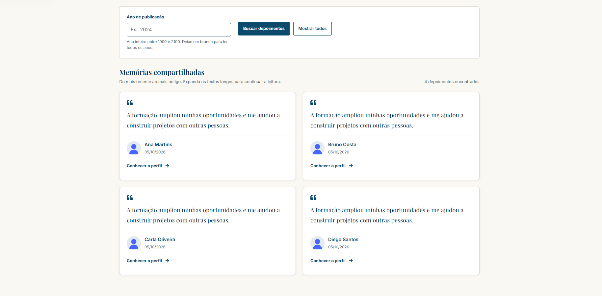

</details>

### Painel do coordenador de curso

Acompanhamento de cursos e egressos, consulta de publicações e preparação de novos destaques.

<details>
<summary>Ver as 4 áreas do painel de coordenação</summary>

#### 1. Visão geral do painel


#### 2. Destaques e publicações

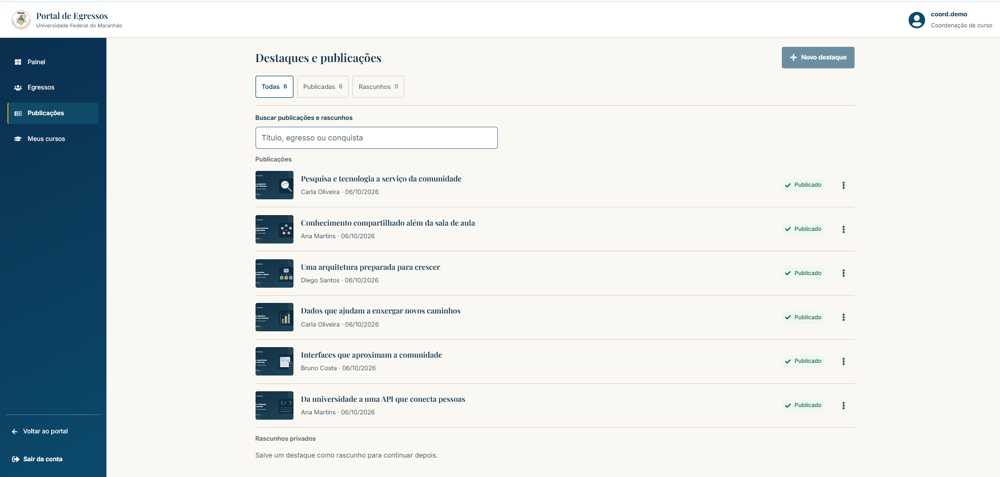

#### 3. Egressos por curso

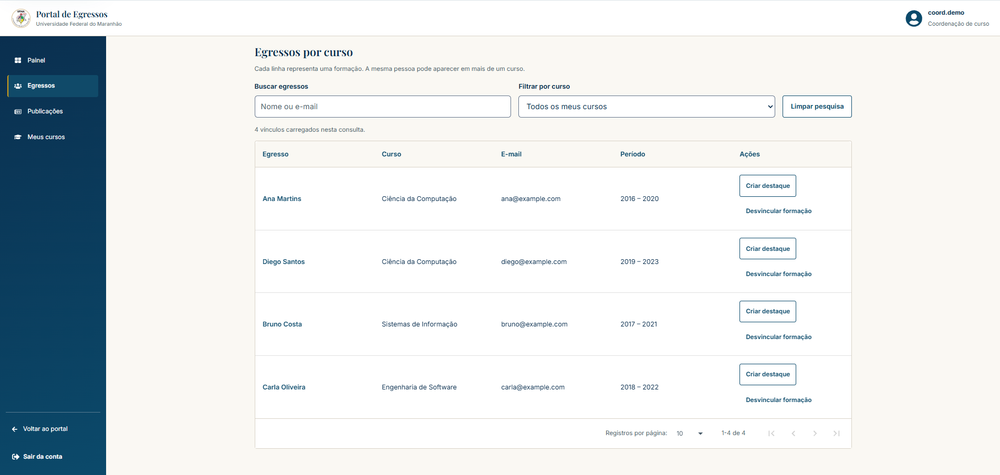

#### 4. Criação de destaque e prévia

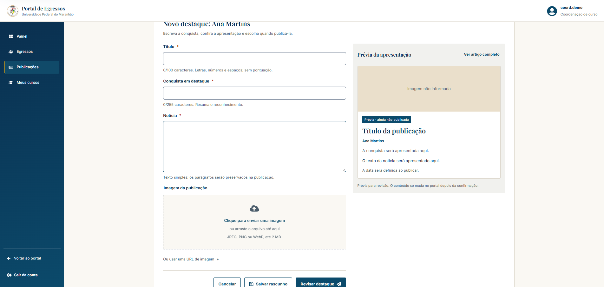

</details>

### Painel da coordenação geral

Administração de contas de coordenação, cursos e responsáveis pela formação.

<details>
<summary>Ver as 3 partes da administração do portal</summary>

#### 1. Visão geral e contas de coordenação

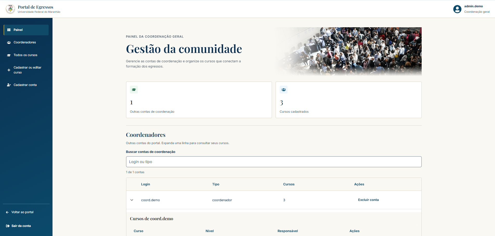

#### 2. Cursos e responsáveis

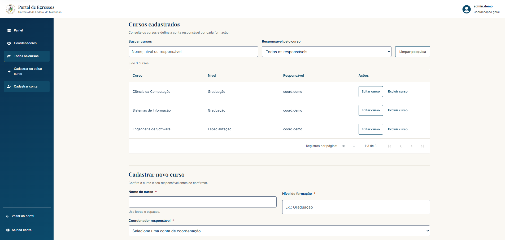

#### 3. Cadastro de cursos e contas

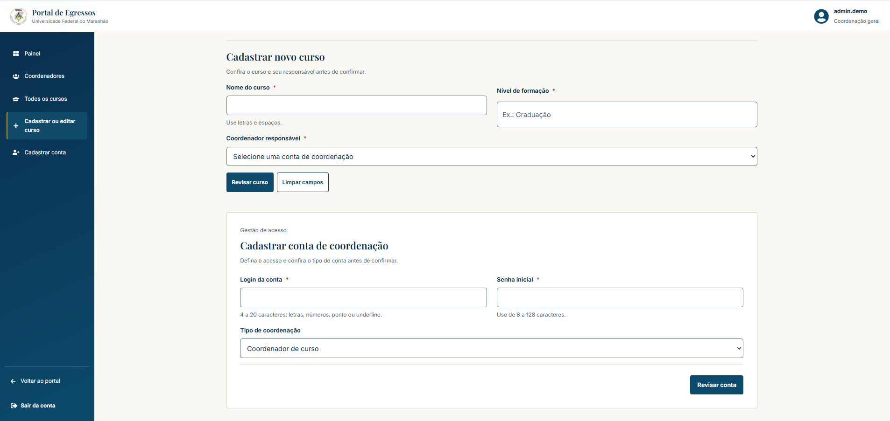

</details>

### Versões mobile

O perfil e os depoimentos se adaptam a telas menores, com conteúdo em uma coluna
e navegação compacta. As quatro capturas do perfil seguem a ordem de rolagem.

<details>
<summary>Ver o perfil público em 4 partes e a leitura de depoimentos no celular</summary>

#### Perfil público — identificação e apresentação

| 1. Identificação e contatos | 2. Depoimento, navegação e apresentação |
| --- | --- |
| 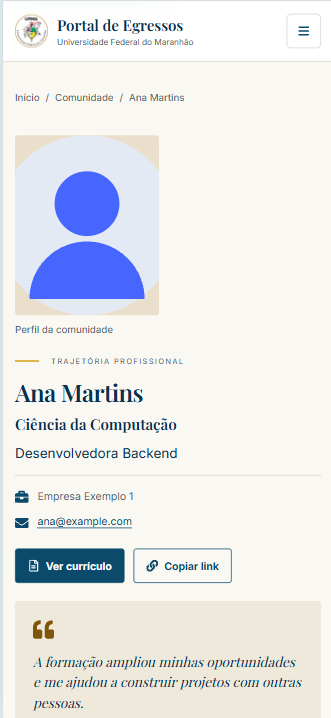 | 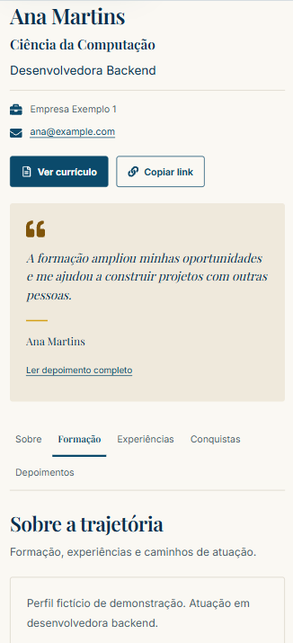 |

#### Perfil público — conquistas e trajetória

| 3. Conquista em evidência e atuação | 4. Formação, experiências e relatos |
| --- | --- |
| 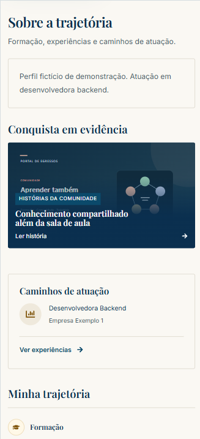 | 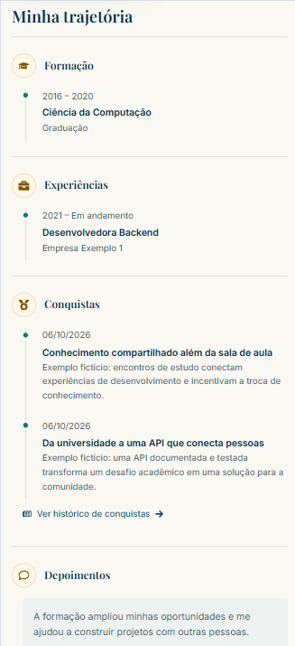 |

#### Depoimentos no celular


</details>

## Especificações técnicas

| Camada | Tecnologias e responsabilidades |
| --- | --- |
| Frontend | React 19, JavaScript/JSX, Vite 6 e React Router 7: componentes, telas e navegação. |
| Interface | CSS Modules, tokens de estilo, styled-components, React Icons e tabelas com React Data Table Component; Inter e Playfair Display locais. |
| Integração | Axios, sessão com cookies, tokens CSRF e chamadas à API REST com endereço configurável. |
| Backend | Java 17, Spring Boot 3.4.3, Spring Web, Spring Data JPA, Bean Validation e Lombok. |
| Dados | PostgreSQL 16 na demonstração; Hibernate/JPA para persistência e relacionamentos. |
| Execução | Maven Wrapper, Node 22 no build Docker, Nginx e Docker Compose. |
| Verificação | JUnit/Spring Boot Test, Mockito, H2 isolado para testes, ESLint e scripts Python. |
| Automação | GitHub Actions para testes, build e validação da demonstração com PostgreSQL. |

As versões e dependências estão declaradas em
[`frontend/package.json`](frontend/package.json) e [`backend/pom.xml`](backend/pom.xml).

## Arquitetura e modelo de dados

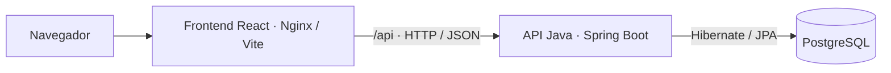
```mermaid
flowchart LR
    Browser["Navegador"] --> Frontend["Frontend React · Nginx / Vite"]
    Frontend -->|"/api · HTTP / JSON"| Backend["API Java · Spring Boot"]
    Backend -->|"Hibernate / JPA"| Database[(PostgreSQL)]
```

No Docker, o Nginx entrega a interface e encaminha as chamadas à API. Durante o
desenvolvimento, o Vite realiza esse encaminhamento. O PostgreSQL fica na rede
interna dos containers, sem publicar uma porta no ambiente completo.

O vínculo `CursoEgresso` relaciona pessoas e cursos com seus períodos acadêmicos.
Cargos, depoimentos e destaques compõem a trajetória; rascunhos guardam publicações
ainda em preparação pela coordenação.

<details>
<summary>Ver as camadas do backend e os relacionamentos das entidades</summary>

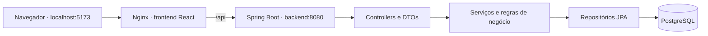
```mermaid
flowchart LR
    Browser["Navegador · localhost:5173"] --> Nginx["Nginx · frontend React"]
    Nginx -->|"/api"| API["Spring Boot · backend:8080"]
    API --> Controller[Controllers e DTOs]
    Controller --> Service[Serviços e regras de negócio]
    Service --> Repository[Repositórios JPA]
    Repository --> DB[(PostgreSQL)]
```

No Compose, o Nginx entrega a aplicação e encaminha `/api` ao backend. No modo
de desenvolvimento, o Vite realiza esse encaminhamento. O backend organiza
entrada HTTP, regras de negócio e acesso ao banco em camadas separadas.

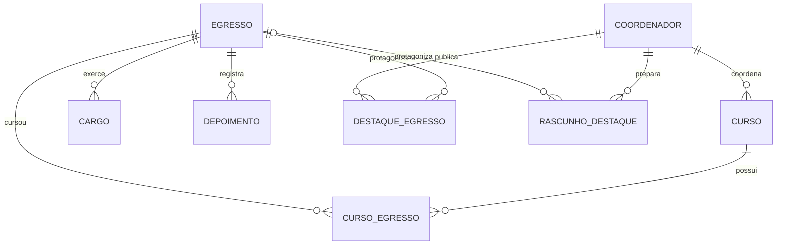
```mermaid
erDiagram
    COORDENADOR ||--o{ CURSO : coordena
    CURSO ||--o{ CURSO_EGRESSO : possui
    EGRESSO ||--o{ CURSO_EGRESSO : cursou
    EGRESSO ||--o{ CARGO : exerce
    EGRESSO ||--o{ DEPOIMENTO : registra
    EGRESSO ||--o{ DESTAQUE_EGRESSO : protagoniza
    COORDENADOR ||--o{ DESTAQUE_EGRESSO : publica
    COORDENADOR ||--o{ RASCUNHO_DESTAQUE : prepara
    EGRESSO |o--o{ RASCUNHO_DESTAQUE : protagoniza
```

`CursoEgresso` representa o vínculo entre um egresso e um curso, incluindo anos
de início e conclusão. Cargos registram a trajetória profissional; depoimentos
guardam os relatos associados ao egresso.

</details>

## Organização do código

```text
.
├── frontend/
│   ├── src/
│   │   ├── pages/           # Telas e fluxos de navegação
│   │   ├── components/      # Componentes reutilizáveis
│   │   ├── auth/            # Sessão e proteção das rotas
│   │   ├── services/        # Configuração e consultas da API
│   │   ├── hooks/           # Consultas, carregamento e operações de gestão
│   │   ├── utils/           # Filtros, datas e tratamento de mensagens
│   │   ├── styles/          # Estilos compartilhados
│   │   ├── assets/          # Imagens, ícones e fontes locais
│   │   └── App.jsx          # Rotas da aplicação
│   ├── public/demo/         # Avatar e currículo fictícios
│   └── tests/               # Testes do frontend com o runner nativo do Node
├── backend/
│   └── src/
│       ├── main/java/com/example/portalegresso/backend/
│       │   ├── controller/ # Endpoints HTTP
│       │   ├── auth/       # Sessões, permissões, CSRF e senhas
│       │   ├── config/     # Configuração de CORS
│       │   ├── dto/        # Objetos de transferência
│       │   ├── exception/  # Tratamento de erros de validação
│       │   ├── service/    # Regras e operações de negócio
│       │   ├── model/      # Entidades e repositórios JPA
│       │   └── demo/       # Carga inicial e verificação de saúde
│       ├── main/resources/ # Configurações por perfil
│       └── test/           # Testes Java e banco isolado
├── docs/                   # Imagens de apresentação; guias neste README
├── scripts/                # Inicializadores e teste HTTP da demo
├── tests/                  # Testes dos inicializadores
├── .github/workflows/      # Automação de validação
├── compose.yaml            # Ambiente completo de demonstração
├── compose.dev.yaml        # Acesso local ao banco para desenvolvimento
├── iniciar.sh              # Inicializador Linux/macOS/WSL
└── iniciar.cmd             # Inicializador Windows
```

Consultas válidas sem registros em `/api/consultas/listar/*` e na listagem geral
de destaques respondem `200` com `[]`. Parâmetros inválidos mantêm `400`; consultas
de depoimentos com limite aceitam de 1 a 100 registros. Falhas do serviço são
apresentadas separadamente de resultados vazios.

Cursos com formações vinculadas precisam ser desvinculados antes da exclusão.
A remoção de uma conta verifica seus cursos antes de apagar dados e executa as
exclusões na mesma transação.

## Qualidade e testes

| Área | Verificação |
| --- | --- |
| Backend | JUnit, Mockito e integração Spring/MockMvc com banco H2 isolado. |
| Frontend | ESLint, testes com o runner nativo do Node e build de produção com Vite. |
| Execução | Testes Python dos inicializadores e validação HTTP dos fluxos da demonstração. |
| Integração contínua | [GitHub Actions](.github/workflows/demo.yml) executa testes, build e validação com PostgreSQL real. |

<details>
<summary>Consultar os comandos de validação e o fluxo de integração contínua</summary>

Execute a partir da raiz, com Java 17+, Node/npm e Python 3 disponíveis:

```bash
# Testes Java: serviços, repositórios e integração da demonstração
cd backend
bash ./mvnw test

# Instalação reproduzível, análise estática e build do frontend
cd ../frontend
npm ci --include=optional
npm run lint
npm test
npm run build

# Testes dos inicializadores
cd ..
python3 -m unittest discover -s tests -v
```

No Windows nativo, use `mvnw.cmd test` no backend e `python` no lugar de
`python3`, conforme a instalação. Os testes Java usam **H2 em modo PostgreSQL**,
isolado do banco de demonstração.

Com os containers em execução, valide o fluxo HTTP completo:

```bash
python3 scripts/smoke_demo.py
```

Esse script verifica sessões e permissões, consultas paginadas, rotas e recursos
do frontend. Cria registros temporários, edita curso e destaque, recupera rascunho
após novo login, rejeita acesso de outro autor e conflito de versão e publica o
rascunho. Ao terminar, remove os registros de validação.
O [workflow de validação](.github/workflows/demo.yml) prepara esses passos com
PostgreSQL real em pushes, pull requests e execução manual no GitHub.

O backend utiliza JUnit, integração Spring/MockMvc e H2 isolado. O frontend
executa casos de regressão com o runner nativo do Node; inicializadores e scripts
demo têm testes Python.
Não há percentual mínimo de cobertura configurado nem suíte automatizada em navegador; aparência, toque e acessibilidade devem ser
revisados também no uso real.

</details>

## Guia de execução e configuração

As instruções completas estão reunidas abaixo. Expanda o tópico correspondente
ao seu ambiente ou à operação que deseja realizar.

### Execução detalhada da demonstração

<details>
<summary>Requisitos, serviços, portas, contas demo, dados e volumes</summary>

#### 1. Preparar a máquina

Instale **Git** e **Docker com Compose v2.20 ou superior**. No Windows/macOS,
use Docker Desktop; no Linux, Docker Engine com o plugin Compose. O Docker deve
estar em execução e configurado para containers Linux.

Por padrão, as portas **5173** e **8080** precisam estar livres; elas podem ser
alteradas na configuração do Compose. A primeira execução precisa
de internet para baixar imagens e dependências; Java, Node e PostgreSQL são
preparados nos containers.

#### 2. Clonar e iniciar

```bash
git clone https://github.com/ucasabreu/app_portal_egresso.git portal-egressos
cd portal-egressos
docker compose up --build
```

Aguarde a inicialização dos serviços e abra **http://localhost:5173**.
O banco de exemplo é criado automaticamente, sem depender de um banco remoto.

| Serviço | Endereço |
| --- | --- |
| Aplicação | http://localhost:5173 |
| Login | http://localhost:5173/login |
| API | http://localhost:8080/api/consultas/listar/egressos |
| Saúde da demo | http://localhost:8080/api/demo/health |

O PostgreSQL fica acessível somente pela rede dos containers no modo padrão.
As portas da aplicação e da API são publicadas em `127.0.0.1`. O Compose
utiliza sua própria configuração de banco e não carrega `.env.local`.

Para abrir o navegador automaticamente e acompanhar os logs:

| Sistema | Inicializador |
| --- | --- |
| Windows | Dois cliques em [`iniciar.cmd`](iniciar.cmd), com Docker Desktop aberto. |
| Linux, macOS ou WSL | `bash iniciar.sh` |

Os inicializadores aguardam os serviços ficarem saudáveis. Ctrl+C encerra os
serviços e preserva os dados. Para executar em segundo plano:

```bash
docker compose up --build -d --wait --wait-timeout 240
```

#### 3. Explorar as contas de exemplo

Acesse **http://localhost:5173/login**:

| Login | Senha | Acesso na interface |
| --- | --- | --- |
| `admin.demo` | `demo123` | Painel do coordenador geral |
| `coord.demo` | `demo123` | Painel do coordenador de curso |
| `ana@example.com` | `demo123` | Perfil e trajetória de Ana |
| `bruno@example.com` | `demo123` | Perfil e trajetória de Bruno |
| `carla@example.com` | `demo123` | Perfil e trajetória de Carla |
| `diego@example.com` | `demo123` | Perfil e trajetória de Diego |

O perfil `demo` inclui **2 coordenadores, 3 cursos e 4 egressos**, com seus
vínculos acadêmicos, cargos, depoimentos e 4 destaques. Os nomes, e-mails, credenciais,
avatar e currículo são fictícios e públicos.

**Para explorar a demonstração:**

1. Abra a lista de egressos e experimente os filtros por curso e cargo.
2. Entre com um e-mail demo e acesse **Meu espaço** ou **Editar perfil** no próprio perfil.
3. Use **Cadastre-se** para criar outro egresso com senha de 8 a 128 caracteres e adicionar curso, cargo e depoimento.
4. Entre com `coord.demo`, consulte seus egressos e experimente salvar, retomar e publicar um rascunho.
5. Explore os destaques na página inicial e a linha do tempo de um egresso.
6. Entre com `admin.demo` e explore o gerenciamento de cursos e coordenadores.

As alterações persistem no volume do PostgreSQL. A carga inicial ocorre somente
quando todas as tabelas do portal estão vazias, dentro de uma transação,
preservando as edições nos próximos inícios.

#### Histórias para apresentação

O catálogo em `scripts/demo/destaques.json` oferece **seis destaques adicionais**
com capas próprias sobre APIs, interfaces, dados, arquitetura, compartilhamento
de conhecimento e pesquisa. Todos são identificados como exemplos fictícios.

Com a demonstração em execução, publique-os a partir da raiz:

```bash
# Atualiza a API, a interface e as capas, preservando o banco
docker compose up -d --build --wait

# Cadastra os destaques pela API, sem alterar os registros existentes
python3 scripts/criar_destaques_demo.py
```

O comando autentica `admin.demo`, mantém cookies e tokens CSRF, consulta os
perfis demo pelos e-mails e usa seus IDs atuais. Ele exige
o perfil `demo`, verifica todas as capas antes de gravar e evita repetir
publicações com o mesmo título, egresso e coordenador. Reexecutá-lo preserva
as edições nos destaques já cadastrados.

A porta é lida de `PORTAL_FRONTEND_PORT` no ambiente ou em `.env`, com padrão
`5173`. Para conferir tudo antes de publicar, acrescente `--dry-run`; para
outro endereço, use `--base-url http://localhost:5180`. Após a publicação,
atualize a página inicial e visite `/destaques` ou o perfil de um egresso.
No Windows nativo, use `python` conforme a instalação.

#### Parar e restaurar

```bash
docker compose down
```

Esse comando encerra os containers e mantém o banco. Para **apagar os dados e
as alterações da demonstração deste projeto** e recriar os exemplos:

```bash
docker compose down --volumes
docker compose up --build
```

As opções dos inicializadores, o desenvolvimento local e a configuração
de outro banco estão detalhados a seguir. Todos os comandos partem da raiz
do repositório, salvo indicação contrária.

</details>

### Executar junto a outros projetos

<details>
<summary>Configurar portas alternativas da interface, API e banco</summary>

Se outro projeto já usa as portas padrão, crie um arquivo `.env` na raiz com
portas livres. Esse arquivo é ignorado pelo Git:

```dotenv
PORTAL_FRONTEND_PORT=5180
PORTAL_BACKEND_PORT=8081
PORTAL_DB_PORT=5433
```

Depois execute `bash iniciar.sh` ou `iniciar.cmd`. Os inicializadores mostram e
abrem a porta publicada; neste exemplo, o Portal fica em
**http://localhost:5180** e a API em **http://localhost:8081**. Também é possível
usar `docker compose up --build -d --wait --wait-timeout 240`.

| Variável | Padrão | Uso |
| --- | --- | --- |
| `PORTAL_FRONTEND_PORT` | `5173` | Porta da interface no modo Docker. |
| `PORTAL_BACKEND_PORT` | `8080` | Porta da API no modo Docker. |
| `PORTAL_DB_PORT` | `5432` | Porta do banco somente com `compose.dev.yaml`. |

O Compose completo **não publica a porta do PostgreSQL**: outro banco pode
continuar usando 5432 na máquina. Não é necessário iniciar o serviço `db`
separadamente para esse modo. As portas internas e os dados persistidos
permanecem os mesmos.

Essas variáveis não alteram as portas do inicializador `--local`, que executa
Java/Vite em 8080/5173. Se publicar o banco em 5433 para desenvolvimento local,
configure `SPRING_DATASOURCE_URL='jdbc:postgresql://localhost:5433/portal_demo'`
em `.env.local`. Esse arquivo é separado do `.env` usado pelo Compose.

Para verificar a demonstração em uma porta alternativa:

```bash
curl -i http://localhost:5180/api/demo/health
python3 scripts/smoke_demo.py --base-url http://localhost:5180
```

</details>

### Inicializadores por sistema

<details>
<summary>Inicialização no Windows, Linux, macOS e WSL</summary>

Os inicializadores validam o Docker, constroem as imagens, aguardam os serviços,
abrem o navegador e acompanham logs. Ctrl+C para os serviços e mantém o banco.

**Linux, macOS e WSL:**

```bash
bash iniciar.sh
bash iniciar.sh --check       # Verifica configuração e acesso ao Docker
bash iniciar.sh --no-browser  # Não abre o navegador
bash iniciar.sh --reinstall   # Reconstrói as imagens sem cache
```

**Windows nativo**, com Docker Desktop aberto, pelo Prompt de Comando:

```bat
iniciar.cmd
iniciar.cmd -Check
iniciar.cmd -NoBrowser
iniciar.cmd -Reinstall
```

Também é possível dar dois cliques em `iniciar.cmd`. As opções do inicializador
Windows seguem a sintaxe PowerShell acima; as opções Bash usam `--`.

</details>

### Desenvolvimento com Java e Node locais

<details>
<summary>Executar Java e Vite localmente com PostgreSQL no Docker</summary>

Essa alternativa executa o frontend com atualização automática e o backend pelo
Maven Wrapper, mantendo apenas o banco no Docker. Use **Linux ou WSL**, JDK 17+,
Node 22/npm, `curl`, `setsid`, `flock`, `sha256sum` e ferramentas usuais de shell.
O wrapper dispensa instalar Maven separadamente.

Pare a demonstração completa antes de iniciar a alternativa, pois ambas usam
as portas 5173 e 8080:

```bash
docker compose down
docker compose -f compose.yaml -f compose.dev.yaml up -d --wait db
bash iniciar.sh --local
```

O arquivo `compose.dev.yaml` publica o PostgreSQL em `127.0.0.1:5432` por padrão;
`PORTAL_DB_PORT` altera essa publicação. A porta escolhida precisa estar livre
e corresponder à URL JDBC de `.env.local`. O inicializador instala as dependências do frontend,
aguarda a API e inicia o Vite. Ctrl+C encerra Java/Vite; o banco Docker continua
em execução até ser encerrado pelo Compose.

```bash
bash iniciar.sh --local --check      # Verifica requisitos e dependências
bash iniciar.sh --local --reinstall  # Reinstala dependências npm
```

No Windows, `iniciar.cmd --local` utiliza WSL. A variável Windows
`PORTAL_WSL_DISTRO` permite selecionar uma distribuição específica.

</details>

### Desenvolvimento apenas do frontend

<details>
<summary>Instalação, servidor de desenvolvimento e comandos do frontend</summary>

Com a API disponível em `127.0.0.1:8080`, execute na pasta `frontend/`:

```bash
npm ci --include=optional
npm run dev
```

O Vite encaminha `/api` ao backend. `VITE_API_URL` permite usar outro endereço
no desenvolvimento ou build, conforme a seção de variáveis.

| Comando em `frontend/` | Finalidade |
| --- | --- |
| `npm run dev` | Servidor local com atualização automática. |
| `npm run lint` | Análise estática com ESLint. |
| `npm test` | Testes dos filtros, paginação, cache, painéis, conteúdo público, validações de gestão e política de imagens. |
| `npm run build` | Build de produção em `dist/`. |
| `npm run preview` | Preview dos arquivos compilados; exige a API em execução. |

</details>

### Variáveis e perfis

<details>
<summary>Configuração do banco, API, perfil demo e portas</summary>

Na alternativa local, `.env.example` é copiado para `.env.local` quando esse
arquivo ainda não existe. O arquivo usa atribuições Bash e é ignorado pelo Git.
O perfil padrão do inicializador é `demo`, com banco `portal_demo` e
usuário/senha públicos `portal_demo`.

| Variável | Finalidade |
| --- | --- |
| `SPRING_PROFILES_ACTIVE` | `demo` ativa os exemplos e o endpoint de saúde. |
| `SPRING_DATASOURCE_URL` | URL JDBC, como `jdbc:postgresql://localhost:5432/portal_demo`. |
| `SPRING_DATASOURCE_USERNAME` | Usuário do PostgreSQL. |
| `SPRING_DATASOURCE_PASSWORD` | Senha do PostgreSQL. |
| `ABRIR_NAVEGADOR` | `1` abre o navegador; `0` desativa no inicializador local. |
| `TEMPO_INICIALIZACAO` | Tempo máximo de espera do backend local, em segundos. |
| `VITE_API_URL` | Endereço alternativo da API na configuração do Vite/build. |
| `PORTAL_COOKIE_SECURE` | `false` para HTTP local; `true` para enviar o cookie somente por HTTPS. |
| `PORTAL_ALLOWED_ORIGINS` | Origens CORS separadas por vírgula; padrão `http://localhost:[*],http://127.0.0.1:[*]`. |
| `PORTAL_SCHEMA_MODE` | `update` na demo; `validate` exige um esquema previamente preparado. |

Para outro banco, configure as três variáveis `SPRING_DATASOURCE_*` e escolha
explicitamente o perfil. O endpoint `/api/demo/health` e a carga fictícia existem
somente em `demo`. Mantenha credenciais particulares fora dos arquivos versionados.

Por padrão, o frontend chama `/api`: o Vite encaminha as requisições para
`http://127.0.0.1:8080`, e o Nginx para `http://backend:8080` no Compose.
`VITE_API_URL` é lida pelo Vite e incorporada ao build; para desenvolvimento,
configure-a no ambiente do processo ou em `frontend/.env.local`. Ao usar
`bash iniciar.sh --local`, as variáveis de `.env.local` da raiz também são
exportadas para os processos iniciados. O Compose não utiliza esse arquivo.

</details>

### Acesso e permissões

<details>
<summary>Sessões, contas, permissões, senhas e CSRF</summary>

A sessão fica no servidor e usa o cookie `PORTAL_EGRESSOS_SESSION`, com
`HttpOnly`, `SameSite=Lax` e expiração após 30 minutos de inatividade. **Sair**
invalida a sessão. Reiniciar a API exige entrar novamente. Não são armazenados
tokens de autenticação no `localStorage`.

| Conta | Permissões |
| --- | --- |
| Visitante | Consultar perfis, cursos, depoimentos e publicações; cadastrar uma conta de egresso. |
| Egresso | Editar o próprio perfil e gerenciar suas formações, experiências e depoimentos. |
| Coordenador | Consultar seu painel, desvincular formações dos seus cursos, publicar para seus egressos, editar seus destaques e gerenciar seus rascunhos. |
| Coordenação geral | Administrar contas e cursos, atribuir responsáveis, editar perfis e publicações e definir senha para um egresso existente. |

A API verifica identidade e propriedade do registro em cada operação protegida.
Rascunhos pertencem exclusivamente ao autor, inclusive perante outras contas de
coordenação geral. Publicar valida o conteúdo, cria o destaque e remove o
rascunho na mesma transação; uma versão desatualizada recebe `409`.

Senhas são armazenadas com salt individual e PBKDF2-HMAC-SHA256, com 600.000
iterações, usando a biblioteca criptográfica do Java. A escolha de custo segue
as [orientações da OWASP](https://cheatsheetseries.owasp.org/cheatsheets/Password_Storage_Cheat_Sheet.html).
O login usa `POST`; os endpoints antigos de credenciais foram desativados (`410`).
Dez tentativas por IP e identificador, dentro de 15 minutos, ativam um bloqueio
local à instância da API (`429`).

**Atualizar uma instalação existente:** execute `docker compose up -d --build --wait`.
O modo `update` acrescenta senha de egresso e a tabela de rascunhos. A inicialização
converte senhas antigas de coordenadores em hashes sem alterar o acesso e sem
reescrever hashes existentes. Somente os quatro e-mails fictícios da tabela demo
recebem `demo123` quando ainda não possuem senha. Outros perfis existentes precisam
de senha definida pela coordenação geral em **Editar perfil**; o cadastro público
não permite assumir um e-mail já registrado. O volume permanece preservado.

Em clientes HTTP, primeiro obtenha `/api/auth/csrf`, conserve os cookies e envie
`X-CSRF-TOKEN` em `POST`, `PUT` e `DELETE`. Após login, obtenha um novo token,
pois o identificador da sessão e o token são renovados. O frontend e os scripts
Python já realizam esse fluxo; falhas de gravação não são repetidas automaticamente.

No Docker, configure as variáveis `PORTAL_*` de sessão em `.env` na raiz;
no inicializador local, use `.env.local`. Ao hospedar por HTTPS, defina
`PORTAL_COOKIE_SECURE=true` e restrinja `PORTAL_ALLOWED_ORIGINS` às origens da
aplicação. O ambiente Compose mantém credenciais públicas e acesso local para
apresentação; substitua a configuração de banco antes de usar dados reais.

</details>

### Contratos da API

<details>
<summary>Endpoints, paginação, respostas e validações</summary>

**Principais contratos da API:**

| Método | Caminho | Finalidade e acesso |
| --- | --- | --- |
| `GET` | `/api/auth/csrf` | Criar/consultar token de segurança; público. |
| `POST` | `/api/auth/login` | Entrar com `{ "login": "coord.demo", "senha": "demo123" }`. |
| `GET` / `POST` | `/api/auth/me` / `/api/auth/logout` | Consultar a sessão / sair. |
| `POST` | `/api/auth/register` | Cadastrar egresso com dados de perfil e `senha`; inicia sua sessão. |
| `GET` | `/api/publico/egressos` | Filtrar por `nome`, `curso`, `cargo`, `anoInicio`, `anoFim`; ordenar por `nome-asc` ou `nome-desc`. |
| `GET` | `/api/publico/destaques` | Buscar por `nome` do egresso/curso; ordenar por `recentes` ou `antigos`. |
| `GET` | `/api/egressos/buscar/egresso/{id}` | Carregar perfil público. |
| `PUT` | `/api/egressos/atualizar/egresso/{id}` | Atualizar perfil; titular ou coordenação geral. |
| `GET` | `/api/coordenadores/buscar/destaque/{id}` | Ler publicação; inexistente recebe `404`. |
| `GET` | `/api/coordenadores/destaque/egresso/{idEgresso}` | Consultar conquistas de um egresso. |
| `GET` | `/api/gestao/painel` | Cursos, vínculos, contas e destaques autorizados, em uma consulta. |
| `POST` | `/api/coordenadores/salvar/coordenador` | Criar coordenador com `login`, `senha` e `tipo` (`coordenador` ou `geral`); coordenação geral. |
| `PUT` | `/api/coordenadores/atualizar/curso/{id}` | Alterar `nome`, `nivel` e `id_coordenador`; coordenação geral. |
| `PUT` | `/api/coordenadores/atualizar/destaque/{id}` | Alterar título, notícia, conquista e imagem; autor ou coordenação geral. |
| `GET` / `POST` | `/api/gestao/rascunhos` | Listar / criar rascunhos privados. |
| `GET` / `PUT` / `DELETE` | `/api/gestao/rascunhos/{id}` | Recuperar / atualizar com `versao` / excluir rascunho próprio. |
| `POST` | `/api/gestao/rascunhos/{id}/publicar` | Publicar versão atual com `{ "versao": 1 }`. |
| `POST` | `/api/gestao/egressos/{id}/senha` | Definir senha com `{ "senha": "..." }`; coordenação geral. |
| `DELETE` | `/api/egressos/deletar/egresso/{id}` | Excluir perfil e vínculos; coordenação geral. |
| `GET` | `/api/demo/health` | Prontidão e conexão com o banco; somente perfil `demo`. |

As consultas `/api/publico/*` usam `pagina` a partir de 1 e `tamanho` entre 1 e
100. A resposta contém `items`, `total`, `page`, `pages`, `size`, `first` e `last`.
Uma pesquisa vazia retorna `items: []`, `total: 0` e intervalo `0–0`; páginas
fora do total são ajustadas para a última disponível. Os cartões de egresso
incluem formações e cargos carregados em lote, evitando uma chamada por cartão.

Exemplo: `/api/publico/egressos?curso=Computa%C3%A7%C3%A3o&pagina=1&tamanho=6`.
A edição de destaque preserva egresso, autoria e data original. A edição de curso
preserva os vínculos e altera qual coordenador pode gerenciá-los.
Erros de validação recebem `400`, sessão ausente `401`, acesso negado ou CSRF
inválido `403`, rascunho/publicação inexistente `404` e conflito de versão `409`.
Os contratos legados mantêm suas mensagens de negócio; falhas do servidor não
são convertidas em resultados vazios.

</details>

### Diagnóstico

<details>
<summary>Comandos de inspeção e solução de problemas de execução</summary>

```bash
docker compose config --quiet
docker compose ps
docker compose logs --tail=100 backend
docker compose logs --tail=100 frontend
docker compose logs --tail=100 db
```

| Sintoma | O que verificar |
| --- | --- |
| Docker indisponível | Abra Docker Desktop ou confirme que o daemon Linux está ativo e acessível. |
| Porta ocupada | No modo Docker, escolha portas livres com `PORTAL_FRONTEND_PORT` e `PORTAL_BACKEND_PORT` em `.env`. O banco só publica uma porta com `compose.dev.yaml`; nesse caso, use `PORTAL_DB_PORT` e ajuste a URL JDBC. |
| Backend não inicia | Consulte logs do backend e do banco; confira URL, credenciais e saúde do PostgreSQL. |
| Exemplos não aparecem | A carga requer o perfil `demo` e um banco inteiramente vazio. |
| Dependências incompatíveis após trocar de sistema | Use `--local --reinstall`; evite reutilizar `node_modules` entre Windows e Linux. |
| Instalação inicial demora ou falha no download | Confira acesso à internet, aos registros Docker e aos repositórios Maven/npm. |

No modo local, instalação e execução geram logs em `.local-run/`.
Com a demonstração iniciada, execute `python3 scripts/smoke_demo.py` para verificar
API, banco e encaminhamento pelo frontend.

</details>

### Escopo da demonstração

<details>
<summary>Dados fictícios, comportamento da interface e limites do ambiente</summary>

O ambiente foi preparado para apresentação local com dados fictícios. Login,
logout e permissões são aplicados pela API e refletem os três tipos de conta.
Não há recuperação de senha por e-mail, autenticação externa ou gerenciamento de
sessões distribuídas; a configuração de hospedagem e operação deve considerar
essas características.

O carrossel inicial apresenta somente conquistas publicadas, ordenadas por data.
Com mais de uma publicação, avança a cada cinco segundos e retorna ao primeiro
destaque. O avanço pausa ao passar o mouse ou navegar pelo teclado; também pode
ser pausado pelo botão e respeita a preferência de movimento reduzido do sistema.
Egressos e depoimentos aparecem em seções próprias. Quando uma consulta falha,
as demais áreas continuam disponíveis e a seção afetada permite tentar novamente.
Com o banco vazio, a página explica a ausência de conteúdo e mantém os caminhos
de exploração e cadastro. Vagas, eventos e mentoria não constituem módulos
implementados nesta versão.

</details>

## Captura e organização das imagens

<details>
<summary>Consultar os arquivos da galeria e como atualizar as capturas</summary>

A apresentação utiliza uma capa vetorial e **26 capturas reais da aplicação**,
organizadas por funcionalidade na [galeria](#principais-telas). Os nomes dos arquivos
identificam a tela e a parte capturada; as legendas descrevem o conteúdo de cada imagem.

### Organização dos arquivos

As capturas ficam em `docs/images/telas/` e são versionadas com o projeto.

| Tela ou fluxo | Arquivos |
| --- | --- |
| Página inicial | `pagina_inicial_01.png` e `pagina_inicial_02.png` |
| Comunidade | `comunidade.png` |
| Perfil público | `perfil_publico_01.png` a `perfil_publico_03.png` |
| Meu espaço | `meu_espaco_01.png` a `meu_espaco_03.png` |
| Edição do perfil | `editar_perfil_01.png` a `editar_perfil_03.png` |
| Publicação de destaque | `destaque_01.png` |
| Depoimentos | `depoimentos_01.png` |
| Coordenação de curso | `coordenador_01.png` a `coordenador_04.png` |
| Coordenação geral | `coordenador_geral_01.png` a `coordenador_geral_03.png` |
| Perfil público no celular | `perfil_publico_mobile_01.png` a `perfil_publico_mobile_04.png` |
| Depoimentos no celular | `depoimentos_mobile_01.png` |

Uma sequência pode representar a rolagem de uma página ou etapas distintas de um
formulário. A galeria segue o conteúdo das capturas: em **Meu espaço**, apresenta a
visão geral, o registro de experiência e depois a formação e os depoimentos.

### Atualizar as capturas

1. Inicie a demonstração conforme as [instruções de execução](#executar-a-demonstração)
   e utilize seus dados fictícios. Acesse perfis e painéis pela interface, sem presumir IDs fixos.
2. Mantenha tamanho de janela e zoom consistentes nas capturas desktop; registre as
   versões mobile separadamente. Aguarde os dados e imagens carregarem.
3. Em páginas longas, capture partes com uma pequena sobreposição para preservar a
   continuidade. Em formulários, registre cada etapa do fluxo.
4. Salve em PNG com nomes em minúsculas, sem espaços ou acentos, usando sufixos como
   `_01`, `_02` e `_03`. Preserve a legibilidade dos textos e evite incluir abas pessoais
   ou ferramentas de desenvolvimento.
5. Ao acrescentar ou renomear uma imagem, atualize sua referência, legenda e texto
   alternativo neste README. Confira o resultado no preview Markdown e no GitHub.

A capa em [`docs/images/capa.svg`](docs/images/capa.svg) é uma composição de
apresentação. As capturas de documentação ficam separadas dos assets da aplicação.

</details>

## Contribuir com o projeto

<details>
<summary>Consultar organização, estilo, testes e orientações de contribuição</summary>

### Organização e estilo

- Coloque telas em `frontend/src/pages/`, componentes em `src/components/` e
  imagens em `src/assets/` ou `public/`. As rotas ficam em `src/App.jsx`.
- No pacote Java `com.example.portalegresso.backend`, use `controller/` para HTTP,
  `service/` para regras de negócio, `dto/` para transferência de dados e
  `model/entidades/` e `model/repository/` para persistência.
- Use dois espaços em JSX e quatro em Java, mantendo as convenções de aspas e
  ponto e vírgula do arquivo. Componentes e classes usam PascalCase;
  funções e métodos usam camelCase.
- Preserve os nomes de domínio em português, como `Egresso` e `Coordenador`.
  Mantenha o CSS próximo ao componente e estilos compartilhados em `src/styles/`.
- Execute ESLint para verificar hooks, exportações e variáveis não utilizadas.
  O projeto não possui formatador automático configurado.

### Testes e revisão

- Espelhe os pacotes Java em `backend/src/test/java/` e nomeie classes `*Test.java`.
  Use métodos descritivos, como `deveGerarErroAoTentarSalvarEgressoNulo`.
- Cubra mudanças em validações de negócio e persistência. Os testes JUnit/Spring
  utilizam configuração isolada em `backend/src/test/resources/` com H2.
- Verifique alterações de interface com lint, build e navegação no navegador.
  Consulte [Qualidade e testes](#qualidade-e-testes) para os comandos completos.
- Para testar e empacotar o backend, execute `bash ./mvnw clean package` em
  `backend/`; no Windows, use `mvnw.cmd clean package`.
- Para iniciar somente a API, configure as variáveis de conexão e execute
  `bash ./mvnw spring-boot:run` em `backend/`; no Windows, use
  `mvnw.cmd spring-boot:run`. O inicializador local automatiza essa configuração
  e também inicia o frontend.

### Commits e pull requests

Use títulos no imperativo e mantenha cada commit focado em uma mudança,
por exemplo: `Adiciona filtro por curso na consulta de egressos`.

Descreva o comportamento alterado no pull request, vincule issues relevantes e
informe comandos de validação e resultados. Inclua capturas de tela nas mudanças
de interface. Configure bancos de teste descartáveis e mantenha credenciais
particulares fora dos arquivos versionados.

</details>
