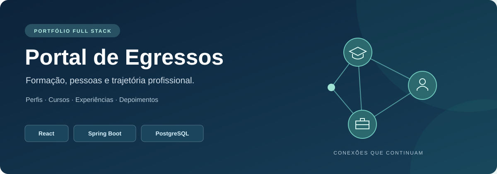
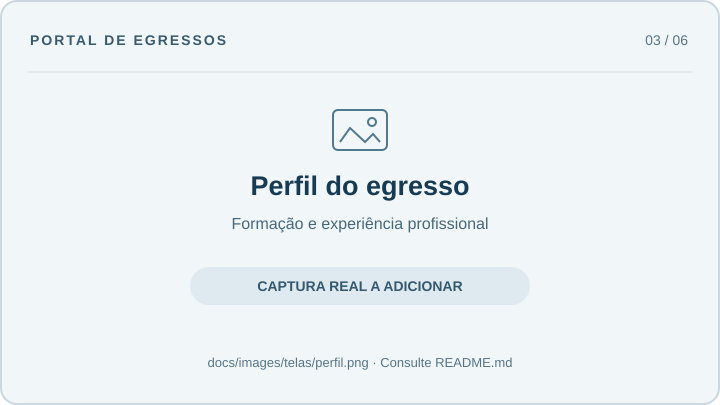
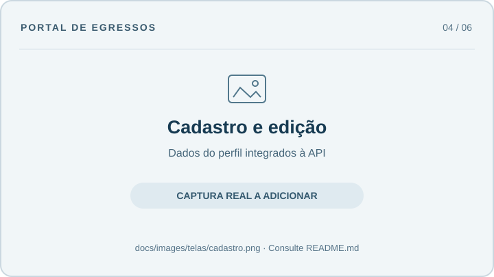
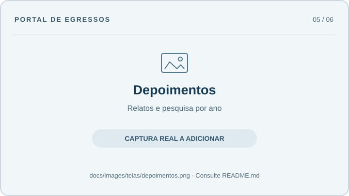
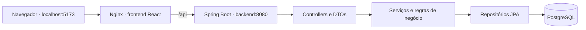
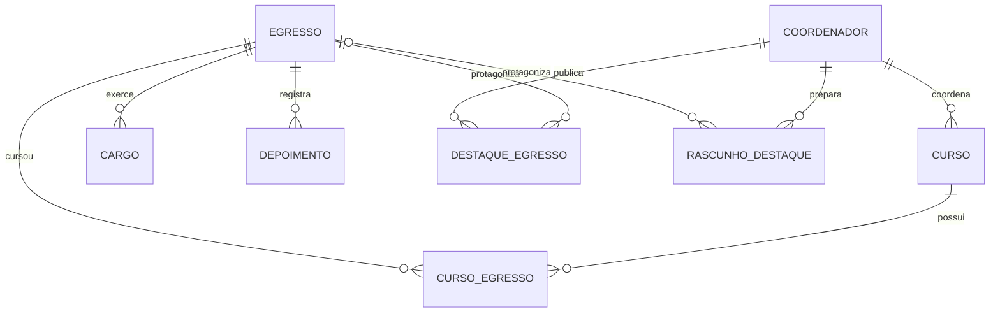

# Portal de Egressos



**Uma aplicação web para apresentar e acompanhar a trajetória de egressos.**

Projeto de portfólio que reúne uma interface em React, uma API em Java/Spring Boot
e persistência em PostgreSQL. O portal organiza perfis, formação acadêmica,
experiência profissional e depoimentos, com telas de consulta pública e painéis
para coordenadores.

**React 19 · Java 17 · Spring Boot 3.4 · PostgreSQL 16 · Docker Compose**

## Navegação

- [Sobre o projeto](#sobre-o-projeto) e [funcionalidades](#funcionalidades)
- [Principais telas](#principais-telas)
- [Executar a demonstração](#executar-a-demonstração) e [inicializadores](#inicializadores-por-sistema)
- [Desenvolvimento local](#desenvolvimento-com-java-e-node-locais) e [frontend](#desenvolvimento-apenas-do-frontend)
- [Variáveis e perfis](#variáveis-e-perfis) e [acesso e permissões](#acesso-e-permissões)
- [Especificações técnicas](#especificações-técnicas), [arquitetura](#arquitetura-e-modelo-de-dados) e [código](#organização-do-código)
- [Qualidade e testes](#qualidade-e-testes) e [diagnóstico](#diagnóstico)
- [Escopo da demonstração](#escopo-da-demonstração)
- [Captura e organização das imagens](#captura-e-organização-das-imagens)
- [Contribuir com o projeto](#contribuir-com-o-projeto)

## Sobre o projeto

O portal aproxima a comunidade acadêmica das trajetórias de seus ex-alunos:
visitantes podem explorar egressos e suas formações, conhecer experiências profissionais
e ler relatos sobre a formação. Os painéis de coordenação reúnem informações
sobre cursos, coordenadores e egressos associados.

O desenvolvimento demonstra integração entre frontend e backend, modelagem de
relacionamentos, operações de cadastro e edição, validações de negócio e
preparação de um ambiente reproduzível para apresentar o software.

## Funcionalidades

| Área | O que é possível fazer |
| --- | --- |
| Página inicial | Descobrir conquistas publicadas, conhecer até seis pessoas da comunidade e ler até três depoimentos recentes. |
| Consulta de egressos | Explorar cartões com formação e experiência, pesquisar por nome/curso/cargo/anos, remover filtros, ordenar e paginar; compartilhar a consulta e retomá-la ao voltar de um perfil. |
| Perfil do egresso | Consultar apresentação, foto, formação, experiências e conquistas; acessar currículo, redes e copiar o link do perfil. |
| Cadastro e edição | Criar uma conta de egresso com senha e preencher identificação, apresentação e contatos em três etapas, conferir os dados e salvar; receber avisos ao sair com alterações não salvas. |
| Trajetória acadêmica e profissional | Registrar formação, experiência e depoimentos com validação e revisão antes de salvar; indicar períodos em andamento. |
| Depoimentos | Registrar relatos, ler textos longos com expansão, pesquisar por ano e compartilhar a consulta. |
| Destaques | Buscar por egresso ou curso, ordenar por data e abrir cada publicação; explorar o histórico por ano e cadastrar, editar ou retomar rascunhos de destaques pelo painel de coordenação. |
| Coordenação de curso | Pesquisar cursos, egressos e publicações; salvar rascunhos privados, conferir a prévia de um destaque antes de publicar e desvincular uma formação preservando o perfil. |
| Coordenação geral | Pesquisar contas e cursos por responsável, criar contas de coordenação, editar cursos e seus responsáveis, definir acesso para perfis existentes e confirmar exclusões com identificação do registro. |

Fotos de perfil e imagens de destaque enviadas por arquivo aceitam **JPEG, PNG
ou WebP, até 2 MB por imagem**. A API valida o tamanho após decodificar o base64
e a assinatura do formato. Também aceita URLs HTTP(S), limitadas a 2.048
caracteres, e caminhos locais como `/demo/avatar.svg`; a disponibilidade de
imagens externas depende do servidor de origem.

Os formulários preservam o conteúdo quando a gravação falha e avisam sobre
alterações não salvas. No editor de destaques, **Salvar rascunho** grava no banco
para recuperar pela mesma conta após recarregar ou acessar outra máquina.
Campos ainda não salvos e formulários de perfil, formação e curso permanecem
somente na aba aberta; não há salvamento automático.

## Principais telas

Os quadros abaixo reservam espaço para **capturas reais das principais telas**.
As orientações para atualizar a galeria estão em
[Captura e organização das imagens](#captura-e-organização-das-imagens).

| Página inicial | Consulta de egressos |
| --- | --- |
|  |  |
| Apresentação do portal, conquistas, egressos e depoimentos. | Listagem com filtros e acesso aos perfis. |

| Perfil do egresso | Cadastro e edição |
| --- | --- |
|  |  |
| Formação, experiência profissional e informações do perfil. | Identificação, apresentação e revisão antes de gravar na API. |

| Depoimentos | Painel da coordenação geral |
| --- | --- |
|  |  |
| Relatos expansíveis, autoria, data e pesquisa por ano. | Consulta e gerenciamento de cursos e coordenadores. |

## Executar a demonstração

### 1. Preparar a máquina

Instale **Git** e **Docker com Compose v2.20 ou superior**. No Windows/macOS,
use Docker Desktop; no Linux, Docker Engine com o plugin Compose. O Docker deve
estar em execução e configurado para containers Linux.

Por padrão, as portas **5173** e **8080** precisam estar livres; elas podem ser
alteradas na configuração do Compose. A primeira execução precisa
de internet para baixar imagens e dependências; Java, Node e PostgreSQL são
preparados nos containers.

### 2. Clonar e iniciar

```bash
git clone https://github.com/ucasabreu/app_portal_egresso.git portal-egressos
cd portal-egressos
docker compose up --build
```

Aguarde a inicialização dos serviços e abra **http://localhost:5173**.
O banco de exemplo é criado automaticamente, sem depender de um banco remoto.

| Serviço | Endereço |
| --- | --- |
| Aplicação | http://localhost:5173 |
| Login | http://localhost:5173/login |
| API | http://localhost:8080/api/consultas/listar/egressos |
| Saúde da demo | http://localhost:8080/api/demo/health |

O PostgreSQL fica acessível somente pela rede dos containers no modo padrão.
As portas da aplicação e da API são publicadas em `127.0.0.1`. O Compose
utiliza sua própria configuração de banco e não carrega `.env.local`.

Para abrir o navegador automaticamente e acompanhar os logs:

| Sistema | Inicializador |
| --- | --- |
| Windows | Dois cliques em [`iniciar.cmd`](iniciar.cmd), com Docker Desktop aberto. |
| Linux, macOS ou WSL | `bash iniciar.sh` |

Os inicializadores aguardam os serviços ficarem saudáveis. Ctrl+C encerra os
serviços e preserva os dados. Para executar em segundo plano:

```bash
docker compose up --build -d --wait --wait-timeout 240
```

### Executar junto a outros projetos

Se outro projeto já usa as portas padrão, crie um arquivo `.env` na raiz com
portas livres. Esse arquivo é ignorado pelo Git:

```dotenv
PORTAL_FRONTEND_PORT=5180
PORTAL_BACKEND_PORT=8081
PORTAL_DB_PORT=5433
```

Depois execute `bash iniciar.sh` ou `iniciar.cmd`. Os inicializadores mostram e
abrem a porta publicada; neste exemplo, o Portal fica em
**http://localhost:5180** e a API em **http://localhost:8081**. Também é possível
usar `docker compose up --build -d --wait --wait-timeout 240`.

| Variável | Padrão | Uso |
| --- | --- | --- |
| `PORTAL_FRONTEND_PORT` | `5173` | Porta da interface no modo Docker. |
| `PORTAL_BACKEND_PORT` | `8080` | Porta da API no modo Docker. |
| `PORTAL_DB_PORT` | `5432` | Porta do banco somente com `compose.dev.yaml`. |

O Compose completo **não publica a porta do PostgreSQL**: outro banco pode
continuar usando 5432 na máquina. Não é necessário iniciar o serviço `db`
separadamente para esse modo. As portas internas e os dados persistidos
permanecem os mesmos.

Essas variáveis não alteram as portas do inicializador `--local`, que executa
Java/Vite em 8080/5173. Se publicar o banco em 5433 para desenvolvimento local,
configure `SPRING_DATASOURCE_URL='jdbc:postgresql://localhost:5433/portal_demo'`
em `.env.local`. Esse arquivo é separado do `.env` usado pelo Compose.

Para verificar a demonstração em uma porta alternativa:

```bash
curl -i http://localhost:5180/api/demo/health
python3 scripts/smoke_demo.py --base-url http://localhost:5180
```

### 3. Explorar as contas de exemplo

Acesse **http://localhost:5173/login**:

| Login | Senha | Acesso na interface |
| --- | --- | --- |
| `admin.demo` | `demo123` | Painel do coordenador geral |
| `coord.demo` | `demo123` | Painel do coordenador de curso |
| `ana@example.com` | `demo123` | Perfil e trajetória de Ana |
| `bruno@example.com` | `demo123` | Perfil e trajetória de Bruno |
| `carla@example.com` | `demo123` | Perfil e trajetória de Carla |
| `diego@example.com` | `demo123` | Perfil e trajetória de Diego |

O perfil `demo` inclui **2 coordenadores, 3 cursos e 4 egressos**, com seus
vínculos acadêmicos, cargos, depoimentos e 4 destaques. Os nomes, e-mails, credenciais,
avatar e currículo são fictícios e públicos.

**Para explorar a demonstração:**

1. Abra a lista de egressos e experimente os filtros por curso e cargo.
2. Entre com um e-mail demo e acesse **Minha área** ou **Editar perfil** no próprio perfil.
3. Use **Cadastre-se** para criar outro egresso com senha de 8 a 128 caracteres e adicionar curso, cargo e depoimento.
4. Entre com `coord.demo`, consulte seus egressos e experimente salvar, retomar e publicar um rascunho.
5. Explore os destaques na página inicial e a linha do tempo de um egresso.
6. Entre com `admin.demo` e explore o gerenciamento de cursos e coordenadores.

As alterações persistem no volume do PostgreSQL. A carga inicial ocorre somente
quando todas as tabelas do portal estão vazias, dentro de uma transação,
preservando as edições nos próximos inícios.

### Histórias para apresentação

O catálogo em `scripts/demo/destaques.json` oferece **seis destaques adicionais**
com capas próprias sobre APIs, interfaces, dados, arquitetura, compartilhamento
de conhecimento e pesquisa. Todos são identificados como exemplos fictícios.

Com a demonstração em execução, publique-os a partir da raiz:

```bash
# Atualiza a API, a interface e as capas, preservando o banco
docker compose up -d --build --wait

# Cadastra os destaques pela API, sem alterar os registros existentes
python3 scripts/criar_destaques_demo.py
```

O comando autentica `admin.demo`, mantém cookies e tokens CSRF, consulta os
perfis demo pelos e-mails e usa seus IDs atuais. Ele exige
o perfil `demo`, verifica todas as capas antes de gravar e evita repetir
publicações com o mesmo título, egresso e coordenador. Reexecutá-lo preserva
as edições nos destaques já cadastrados.

A porta é lida de `PORTAL_FRONTEND_PORT` no ambiente ou em `.env`, com padrão
`5173`. Para conferir tudo antes de publicar, acrescente `--dry-run`; para
outro endereço, use `--base-url http://localhost:5180`. Após a publicação,
atualize a página inicial e visite `/destaques` ou o perfil de um egresso.
No Windows nativo, use `python` conforme a instalação.

### Parar e restaurar

```bash
docker compose down
```

Esse comando encerra os containers e mantém o banco. Para **apagar os dados e
as alterações da demonstração deste projeto** e recriar os exemplos:

```bash
docker compose down --volumes
docker compose up --build
```

As opções dos inicializadores, o desenvolvimento local e a configuração
de outro banco estão detalhados a seguir. Todos os comandos partem da raiz
do repositório, salvo indicação contrária.

## Inicializadores por sistema

Os inicializadores validam o Docker, constroem as imagens, aguardam os serviços,
abrem o navegador e acompanham logs. Ctrl+C para os serviços e mantém o banco.

**Linux, macOS e WSL:**

```bash
bash iniciar.sh
bash iniciar.sh --check       # Verifica configuração e acesso ao Docker
bash iniciar.sh --no-browser  # Não abre o navegador
bash iniciar.sh --reinstall   # Reconstrói as imagens sem cache
```

**Windows nativo**, com Docker Desktop aberto, pelo Prompt de Comando:

```bat
iniciar.cmd
iniciar.cmd -Check
iniciar.cmd -NoBrowser
iniciar.cmd -Reinstall
```

Também é possível dar dois cliques em `iniciar.cmd`. As opções do inicializador
Windows seguem a sintaxe PowerShell acima; as opções Bash usam `--`.

## Desenvolvimento com Java e Node locais

Essa alternativa executa o frontend com atualização automática e o backend pelo
Maven Wrapper, mantendo apenas o banco no Docker. Use **Linux ou WSL**, JDK 17+,
Node 22/npm, `curl`, `setsid`, `flock`, `sha256sum` e ferramentas usuais de shell.
O wrapper dispensa instalar Maven separadamente.

Pare a demonstração completa antes de iniciar a alternativa, pois ambas usam
as portas 5173 e 8080:

```bash
docker compose down
docker compose -f compose.yaml -f compose.dev.yaml up -d --wait db
bash iniciar.sh --local
```

O arquivo `compose.dev.yaml` publica o PostgreSQL em `127.0.0.1:5432` por padrão;
`PORTAL_DB_PORT` altera essa publicação. A porta escolhida precisa estar livre
e corresponder à URL JDBC de `.env.local`. O inicializador instala as dependências do frontend,
aguarda a API e inicia o Vite. Ctrl+C encerra Java/Vite; o banco Docker continua
em execução até ser encerrado pelo Compose.

```bash
bash iniciar.sh --local --check      # Verifica requisitos e dependências
bash iniciar.sh --local --reinstall  # Reinstala dependências npm
```

No Windows, `iniciar.cmd --local` utiliza WSL. A variável Windows
`PORTAL_WSL_DISTRO` permite selecionar uma distribuição específica.

## Variáveis e perfis

Na alternativa local, `.env.example` é copiado para `.env.local` quando esse
arquivo ainda não existe. O arquivo usa atribuições Bash e é ignorado pelo Git.
O perfil padrão do inicializador é `demo`, com banco `portal_demo` e
usuário/senha públicos `portal_demo`.

| Variável | Finalidade |
| --- | --- |
| `SPRING_PROFILES_ACTIVE` | `demo` ativa os exemplos e o endpoint de saúde. |
| `SPRING_DATASOURCE_URL` | URL JDBC, como `jdbc:postgresql://localhost:5432/portal_demo`. |
| `SPRING_DATASOURCE_USERNAME` | Usuário do PostgreSQL. |
| `SPRING_DATASOURCE_PASSWORD` | Senha do PostgreSQL. |
| `ABRIR_NAVEGADOR` | `1` abre o navegador; `0` desativa no inicializador local. |
| `TEMPO_INICIALIZACAO` | Tempo máximo de espera do backend local, em segundos. |
| `VITE_API_URL` | Endereço alternativo da API na configuração do Vite/build. |
| `PORTAL_COOKIE_SECURE` | `false` para HTTP local; `true` para enviar o cookie somente por HTTPS. |
| `PORTAL_ALLOWED_ORIGINS` | Origens CORS separadas por vírgula; padrão `http://localhost:[*],http://127.0.0.1:[*]`. |
| `PORTAL_SCHEMA_MODE` | `update` na demo; `validate` exige um esquema previamente preparado. |

Para outro banco, configure as três variáveis `SPRING_DATASOURCE_*` e escolha
explicitamente o perfil. O endpoint `/api/demo/health` e a carga fictícia existem
somente em `demo`. Mantenha credenciais particulares fora dos arquivos versionados.

Por padrão, o frontend chama `/api`: o Vite encaminha as requisições para
`http://127.0.0.1:8080`, e o Nginx para `http://backend:8080` no Compose.
`VITE_API_URL` é lida pelo Vite e incorporada ao build; para desenvolvimento,
configure-a no ambiente do processo ou em `frontend/.env.local`. Ao usar
`bash iniciar.sh --local`, as variáveis de `.env.local` da raiz também são
exportadas para os processos iniciados. O Compose não utiliza esse arquivo.

## Acesso e permissões

A sessão fica no servidor e usa o cookie `PORTAL_EGRESSOS_SESSION`, com
`HttpOnly`, `SameSite=Lax` e expiração após 30 minutos de inatividade. **Sair**
invalida a sessão. Reiniciar a API exige entrar novamente. Não são armazenados
tokens de autenticação no `localStorage`.

| Conta | Permissões |
| --- | --- |
| Visitante | Consultar perfis, cursos, depoimentos e publicações; cadastrar uma conta de egresso. |
| Egresso | Editar o próprio perfil e gerenciar suas formações, experiências e depoimentos. |
| Coordenador | Consultar seu painel, desvincular formações dos seus cursos, publicar para seus egressos, editar seus destaques e gerenciar seus rascunhos. |
| Coordenação geral | Administrar contas e cursos, atribuir responsáveis, editar perfis e publicações e definir senha para um egresso existente. |

A API verifica identidade e propriedade do registro em cada operação protegida.
Rascunhos pertencem exclusivamente ao autor, inclusive perante outras contas de
coordenação geral. Publicar valida o conteúdo, cria o destaque e remove o
rascunho na mesma transação; uma versão desatualizada recebe `409`.

Senhas são armazenadas com salt individual e PBKDF2-HMAC-SHA256, com 600.000
iterações, usando a biblioteca criptográfica do Java. A escolha de custo segue
as [orientações da OWASP](https://cheatsheetseries.owasp.org/cheatsheets/Password_Storage_Cheat_Sheet.html).
O login usa `POST`; os endpoints antigos de credenciais foram desativados (`410`).
Dez tentativas por IP e identificador, dentro de 15 minutos, ativam um bloqueio
local à instância da API (`429`).

**Atualizar uma instalação existente:** execute `docker compose up -d --build --wait`.
O modo `update` acrescenta senha de egresso e a tabela de rascunhos. A inicialização
converte senhas antigas de coordenadores em hashes sem alterar o acesso e sem
reescrever hashes existentes. Somente os quatro e-mails fictícios da tabela demo
recebem `demo123` quando ainda não possuem senha. Outros perfis existentes precisam
de senha definida pela coordenação geral em **Editar perfil**; o cadastro público
não permite assumir um e-mail já registrado. O volume permanece preservado.

Em clientes HTTP, primeiro obtenha `/api/auth/csrf`, conserve os cookies e envie
`X-CSRF-TOKEN` em `POST`, `PUT` e `DELETE`. Após login, obtenha um novo token,
pois o identificador da sessão e o token são renovados. O frontend e os scripts
Python já realizam esse fluxo; falhas de gravação não são repetidas automaticamente.

No Docker, configure as variáveis `PORTAL_*` de sessão em `.env` na raiz;
no inicializador local, use `.env.local`. Ao hospedar por HTTPS, defina
`PORTAL_COOKIE_SECURE=true` e restrinja `PORTAL_ALLOWED_ORIGINS` às origens da
aplicação. O ambiente Compose mantém credenciais públicas e acesso local para
apresentação; substitua a configuração de banco antes de usar dados reais.

## Desenvolvimento apenas do frontend

Com a API disponível em `127.0.0.1:8080`, execute na pasta `frontend/`:

```bash
npm ci --include=optional
npm run dev
```

O Vite encaminha `/api` ao backend. `VITE_API_URL` permite usar outro endereço
no desenvolvimento ou build, conforme a seção de variáveis.

| Comando em `frontend/` | Finalidade |
| --- | --- |
| `npm run dev` | Servidor local com atualização automática. |
| `npm run lint` | Análise estática com ESLint. |
| `npm test` | Testes dos filtros, paginação, cache, painéis, conteúdo público, validações de gestão e política de imagens. |
| `npm run build` | Build de produção em `dist/`. |
| `npm run preview` | Preview dos arquivos compilados; exige a API em execução. |

## Especificações técnicas

| Camada | Tecnologias e responsabilidades |
| --- | --- |
| Frontend | React 19, JavaScript/JSX, Vite 6 e React Router 7: componentes, telas e navegação. |
| Interface | CSS, styled-components 6, React Icons, Swiper e React Data Table Component. |
| Integração | Axios, sessão com cookies, tokens CSRF e chamadas à API REST com endereço configurável. |
| Backend | Java 17, Spring Boot 3.4.3, Spring Web, Spring Data JPA, Bean Validation e Lombok. |
| Dados | PostgreSQL 16 na demonstração; Hibernate/JPA para persistência e relacionamentos. |
| Execução | Maven Wrapper, Node 22 no build Docker, Nginx e Docker Compose. |
| Verificação | JUnit/Spring Boot Test, Mockito, H2 isolado para testes, ESLint e scripts Python. |
| Automação | GitHub Actions para testes, build e validação da demonstração com PostgreSQL. |

As versões e dependências estão declaradas em
[`frontend/package.json`](frontend/package.json) e [`backend/pom.xml`](backend/pom.xml).

## Arquitetura e modelo de dados



No Compose, o Nginx entrega a aplicação e encaminha `/api` ao backend. No modo
de desenvolvimento, o Vite realiza esse encaminhamento. O backend organiza
entrada HTTP, regras de negócio e acesso ao banco em camadas separadas.



`CursoEgresso` representa o vínculo entre um egresso e um curso, incluindo anos
de início e conclusão. Cargos registram a trajetória profissional; depoimentos
guardam os relatos associados ao egresso.

**Principais contratos da API:**

| Método | Caminho | Finalidade e acesso |
| --- | --- | --- |
| `GET` | `/api/auth/csrf` | Criar/consultar token de segurança; público. |
| `POST` | `/api/auth/login` | Entrar com `{ "login": "coord.demo", "senha": "demo123" }`. |
| `GET` / `POST` | `/api/auth/me` / `/api/auth/logout` | Consultar a sessão / sair. |
| `POST` | `/api/auth/register` | Cadastrar egresso com dados de perfil e `senha`; inicia sua sessão. |
| `GET` | `/api/publico/egressos` | Filtrar por `nome`, `curso`, `cargo`, `anoInicio`, `anoFim`; ordenar por `nome-asc` ou `nome-desc`. |
| `GET` | `/api/publico/destaques` | Buscar por `nome` do egresso/curso; ordenar por `recentes` ou `antigos`. |
| `GET` | `/api/egressos/buscar/egresso/{id}` | Carregar perfil público. |
| `PUT` | `/api/egressos/atualizar/egresso/{id}` | Atualizar perfil; titular ou coordenação geral. |
| `GET` | `/api/coordenadores/buscar/destaque/{id}` | Ler publicação; inexistente recebe `404`. |
| `GET` | `/api/coordenadores/destaque/egresso/{idEgresso}` | Consultar conquistas de um egresso. |
| `GET` | `/api/gestao/painel` | Cursos, vínculos, contas e destaques autorizados, em uma consulta. |
| `POST` | `/api/coordenadores/salvar/coordenador` | Criar coordenador com `login`, `senha` e `tipo` (`coordenador` ou `geral`); coordenação geral. |
| `PUT` | `/api/coordenadores/atualizar/curso/{id}` | Alterar `nome`, `nivel` e `id_coordenador`; coordenação geral. |
| `PUT` | `/api/coordenadores/atualizar/destaque/{id}` | Alterar título, notícia, conquista e imagem; autor ou coordenação geral. |
| `GET` / `POST` | `/api/gestao/rascunhos` | Listar / criar rascunhos privados. |
| `GET` / `PUT` / `DELETE` | `/api/gestao/rascunhos/{id}` | Recuperar / atualizar com `versao` / excluir rascunho próprio. |
| `POST` | `/api/gestao/rascunhos/{id}/publicar` | Publicar versão atual com `{ "versao": 1 }`. |
| `POST` | `/api/gestao/egressos/{id}/senha` | Definir senha com `{ "senha": "..." }`; coordenação geral. |
| `DELETE` | `/api/egressos/deletar/egresso/{id}` | Excluir perfil e vínculos; coordenação geral. |
| `GET` | `/api/demo/health` | Prontidão e conexão com o banco; somente perfil `demo`. |

As consultas `/api/publico/*` usam `pagina` a partir de 1 e `tamanho` entre 1 e
100. A resposta contém `items`, `total`, `page`, `pages`, `size`, `first` e `last`.
Uma pesquisa vazia retorna `items: []`, `total: 0` e intervalo `0–0`; páginas
fora do total são ajustadas para a última disponível. Os cartões de egresso
incluem formações e cargos carregados em lote, evitando uma chamada por cartão.

Exemplo: `/api/publico/egressos?curso=Computa%C3%A7%C3%A3o&pagina=1&tamanho=6`.
A edição de destaque preserva egresso, autoria e data original. A edição de curso
preserva os vínculos e altera qual coordenador pode gerenciá-los.
Erros de validação recebem `400`, sessão ausente `401`, acesso negado ou CSRF
inválido `403`, rascunho/publicação inexistente `404` e conflito de versão `409`.
Os contratos legados mantêm suas mensagens de negócio; falhas do servidor não
são convertidas em resultados vazios.

## Organização do código

```text
.
├── frontend/
│   ├── src/
│   │   ├── pages/           # Telas e fluxos de navegação
│   │   ├── components/      # Componentes reutilizáveis
│   │   ├── auth/            # Sessão e proteção das rotas
│   │   ├── services/        # Configuração e consultas da API
│   │   ├── hooks/           # Consultas, carregamento e operações de gestão
│   │   ├── utils/           # Filtros, datas e tratamento de mensagens
│   │   ├── styles/          # Estilos compartilhados
│   │   ├── assets/          # Imagens e ícones da interface
│   │   └── App.jsx          # Rotas da aplicação
│   ├── public/demo/         # Avatar e currículo fictícios
│   └── tests/               # Testes do frontend com o runner nativo do Node
├── backend/
│   └── src/
│       ├── main/java/com/example/portalegresso/backend/
│       │   ├── controller/ # Endpoints HTTP
│       │   ├── auth/       # Sessões, permissões, CSRF e senhas
│       │   ├── config/     # Configuração de CORS
│       │   ├── dto/        # Objetos de transferência
│       │   ├── exception/  # Tratamento de erros de validação
│       │   ├── service/    # Regras e operações de negócio
│       │   ├── model/      # Entidades e repositórios JPA
│       │   └── demo/       # Carga inicial e verificação de saúde
│       ├── main/resources/ # Configurações por perfil
│       └── test/           # Testes Java e banco isolado
├── docs/                   # Imagens de apresentação; guias neste README
├── scripts/                # Inicializadores e teste HTTP da demo
├── tests/                  # Testes dos inicializadores
├── .github/workflows/      # Automação de validação
├── compose.yaml            # Ambiente completo de demonstração
├── compose.dev.yaml        # Acesso local ao banco para desenvolvimento
├── iniciar.sh              # Inicializador Linux/macOS/WSL
└── iniciar.cmd             # Inicializador Windows
```

Consultas válidas sem registros em `/api/consultas/listar/*` e na listagem geral
de destaques respondem `200` com `[]`. Parâmetros inválidos mantêm `400`; consultas
de depoimentos com limite aceitam de 1 a 100 registros. Falhas do serviço são
apresentadas separadamente de resultados vazios.

Cursos com formações vinculadas precisam ser desvinculados antes da exclusão.
A remoção de uma conta verifica seus cursos antes de apagar dados e executa as
exclusões na mesma transação.

## Qualidade e testes

Execute a partir da raiz, com Java 17+, Node/npm e Python 3 disponíveis:

```bash
# Testes Java: serviços, repositórios e integração da demonstração
cd backend
bash ./mvnw test

# Instalação reproduzível, análise estática e build do frontend
cd ../frontend
npm ci --include=optional
npm run lint
npm test
npm run build

# Testes dos inicializadores
cd ..
python3 -m unittest discover -s tests -v
```

No Windows nativo, use `mvnw.cmd test` no backend e `python` no lugar de
`python3`, conforme a instalação. Os testes Java usam **H2 em modo PostgreSQL**,
isolado do banco de demonstração.

Com os containers em execução, valide o fluxo HTTP completo:

```bash
python3 scripts/smoke_demo.py
```

Esse script verifica sessões e permissões, consultas paginadas, rotas e recursos
do frontend. Cria registros temporários, edita curso e destaque, recupera rascunho
após novo login, rejeita acesso de outro autor e conflito de versão e publica o
rascunho. Ao terminar, remove os registros de validação.
O [workflow de validação](.github/workflows/demo.yml) prepara esses passos com
PostgreSQL real em pushes, pull requests e execução manual no GitHub.

O backend possui 185 testes com JUnit, integração Spring/MockMvc e H2 isolado.
O frontend possui 78 casos de regressão em oito arquivos, executados pelo
runner nativo do Node. Os inicializadores e os scripts demo têm 27 testes Python.
Não há percentual mínimo de cobertura configurado nem suíte automatizada em navegador; aparência, toque e acessibilidade devem ser
revisados também no uso real.

## Diagnóstico

```bash
docker compose config --quiet
docker compose ps
docker compose logs --tail=100 backend
docker compose logs --tail=100 frontend
docker compose logs --tail=100 db
```

| Sintoma | O que verificar |
| --- | --- |
| Docker indisponível | Abra Docker Desktop ou confirme que o daemon Linux está ativo e acessível. |
| Porta ocupada | No modo Docker, escolha portas livres com `PORTAL_FRONTEND_PORT` e `PORTAL_BACKEND_PORT` em `.env`. O banco só publica uma porta com `compose.dev.yaml`; nesse caso, use `PORTAL_DB_PORT` e ajuste a URL JDBC. |
| Backend não inicia | Consulte logs do backend e do banco; confira URL, credenciais e saúde do PostgreSQL. |
| Exemplos não aparecem | A carga requer o perfil `demo` e um banco inteiramente vazio. |
| Dependências incompatíveis após trocar de sistema | Use `--local --reinstall`; evite reutilizar `node_modules` entre Windows e Linux. |
| Instalação inicial demora ou falha no download | Confira acesso à internet, aos registros Docker e aos repositórios Maven/npm. |

No modo local, instalação e execução geram logs em `.local-run/`.
Com a demonstração iniciada, execute `python3 scripts/smoke_demo.py` para verificar
API, banco e encaminhamento pelo frontend.

## Escopo da demonstração

O ambiente foi preparado para apresentação local com dados fictícios. Login,
logout e permissões são aplicados pela API e refletem os três tipos de conta.
Não há recuperação de senha por e-mail, autenticação externa ou gerenciamento de
sessões distribuídas; a configuração de hospedagem e operação deve considerar
essas características.

O carrossel inicial apresenta somente conquistas publicadas, ordenadas por data.
Com mais de uma publicação, avança a cada cinco segundos e retorna ao primeiro
destaque. O avanço pausa ao passar o mouse ou navegar pelo teclado; também pode
ser pausado pelo botão e respeita a preferência de movimento reduzido do sistema.
Egressos e depoimentos aparecem em seções próprias. Quando uma consulta falha,
as demais áreas continuam disponíveis e a seção afetada permite tentar novamente.
Com o banco vazio, a página explica a ausência de conteúdo e mantém os caminhos
de exploração e cadastro. Vagas, eventos e mentoria não constituem módulos
implementados nesta versão.

## Captura e organização das imagens

A galeria inclui uma capa vetorial e seis espaços reservados para capturas.
Os arquivos SVG das telas são identificadores de posição; não representam
a interface real da aplicação.

### Preparar as capturas

1. Inicie o projeto seguindo as [instruções de execução](#executar-a-demonstração).
2. Abra `http://localhost:5173` e utilize os dados fictícios da demonstração.
3. Use uma janela de navegador com tamanho consistente, preferencialmente
   1440 × 900, zoom de 100% e a mesma configuração de tema em todas as capturas.
4. Aguarde as consultas e imagens carregarem; feche menus e mensagens temporárias.
5. Capture a área da aplicação. Evite incluir abas pessoais, dados particulares
   ou ferramentas de desenvolvimento.

### Galeria principal

Salve as capturas em `docs/images/telas/` com os nomes abaixo:

| Arquivo sugerido | Como chegar à tela | O que mostrar |
| --- | --- | --- |
| `inicio.png` | Página inicial `/`. | Banner, conquistas reais e prévia da comunidade. |
| `egressos.png` | `/egressos/listar`. | Lista preenchida e controles de filtro. |
| `perfil.png` | Abra um egresso pela listagem. | Perfil com formação e experiência; a rota usa o ID real do registro. |
| `cadastro.png` | **Editar perfil** em um perfil existente. | Formulário preenchido com dados demo; para cadastro vazio, use `/edit-egresso`. |
| `depoimentos.png` | `/egressos/depoimentos`. | Relatos carregados e filtro por ano. |
| `coordenacao.png` | `/login`, conta `admin.demo`, senha `demo123`. | Painel geral com cursos e coordenadores. |

O painel da conta `coord.demo` pode receber uma imagem adicional chamada
`coordenador-curso.png`. Adicione uma nova linha à galeria se quiser destacar
esse fluxo. Não presuma IDs fixos: entre pela interface para acessar perfis e painéis.

### Substituir os espaços reservados

Depois de salvar cada PNG, altere apenas a referência correspondente no README:

```markdown
<!-- Antes -->


<!-- Depois -->

```

Repita para os demais arquivos. Atualize o texto introdutório da galeria quando
as seis capturas estiverem disponíveis. Até lá, mantenha explícito quais imagens
são espaços reservados. Os SVGs substituídos podem ser removidos após conferir
que nenhum documento ainda os referencia.

### Padrão dos arquivos

- Use nomes curtos em minúsculas, sem espaços ou acentos.
- Prefira PNG para preservar a legibilidade de textos; WebP também é aceito,
  desde que a extensão no README acompanhe o arquivo.
- Evite arquivos acima de 1 MB quando possível, sem comprometer a leitura.
- Preserve textos alternativos específicos para cada tela.
- Confira a galeria no preview Markdown e, após publicar, no GitHub.

As imagens da documentação ficam separadas dos assets usados pela aplicação.
A capa em [`docs/images/capa.svg`](docs/images/capa.svg) é uma composição de apresentação
e pode ser ajustada sem alterar a interface do projeto.

## Contribuir com o projeto

### Organização e estilo

- Coloque telas em `frontend/src/pages/`, componentes em `src/components/` e
  imagens em `src/assets/` ou `public/`. As rotas ficam em `src/App.jsx`.
- No pacote Java `com.example.portalegresso.backend`, use `controller/` para HTTP,
  `service/` para regras de negócio, `dto/` para transferência de dados e
  `model/entidades/` e `model/repository/` para persistência.
- Use dois espaços em JSX e quatro em Java, mantendo as convenções de aspas e
  ponto e vírgula do arquivo. Componentes e classes usam PascalCase;
  funções e métodos usam camelCase.
- Preserve os nomes de domínio em português, como `Egresso` e `Coordenador`.
  Mantenha o CSS próximo ao componente e estilos compartilhados em `src/styles/`.
- Execute ESLint para verificar hooks, exportações e variáveis não utilizadas.
  O projeto não possui formatador automático configurado.

### Testes e revisão

- Espelhe os pacotes Java em `backend/src/test/java/` e nomeie classes `*Test.java`.
  Use métodos descritivos, como `deveGerarErroAoTentarSalvarEgressoNulo`.
- Cubra mudanças em validações de negócio e persistência. Os testes JUnit/Spring
  utilizam configuração isolada em `backend/src/test/resources/` com H2.
- Verifique alterações de interface com lint, build e navegação no navegador.
  Consulte [Qualidade e testes](#qualidade-e-testes) para os comandos completos.
- Para testar e empacotar o backend, execute `bash ./mvnw clean package` em
  `backend/`; no Windows, use `mvnw.cmd clean package`.
- Para iniciar somente a API, configure as variáveis de conexão e execute
  `bash ./mvnw spring-boot:run` em `backend/`; no Windows, use
  `mvnw.cmd spring-boot:run`. O inicializador local automatiza essa configuração
  e também inicia o frontend.

### Commits e pull requests

Use títulos no imperativo e mantenha cada commit focado em uma mudança,
por exemplo: `Adiciona filtro por curso na consulta de egressos`.

Descreva o comportamento alterado no pull request, vincule issues relevantes e
informe comandos de validação e resultados. Inclua capturas de tela nas mudanças
de interface. Configure bancos de teste descartáveis e mantenha credenciais
particulares fora dos arquivos versionados.
