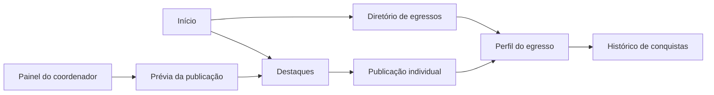

# Plano de evolução da experiência do Portal de Egressos

Análise de 6 de outubro de 2026, na branch `feat/frontend-redesign`.

## Objetivo e escopo

Transformar o portal em uma apresentação clara da comunidade: descobrir pessoas, conhecer suas trajetórias e ler conquistas publicadas pela coordenação. A gestão deve facilitar essas publicações e explicar os vínculos entre contas, cursos e egressos.

Este documento orienta a evolução por etapas. O painel corrigido foi validado pelo usuário; a etapa 1 de conteúdo público foi implementada no frontend e passou nas verificações automatizadas, com revisão visual e integração local pendentes. As demais etapas continuam propostas. O README continua destinado à apresentação e execução do software.

## 1. Diagnóstico inicial

A análise considera as rotas em `frontend/src/App.jsx`, páginas, componentes, estilos, hooks, contratos dos controllers, entidades e dados de demonstração. A tabela abaixo registra o ponto de partida; o acompanhamento das implementações fica na seção 9. Há uma base visual compartilhada, componentes de formulário e feedback, carregamento de páginas sob demanda e carrossel com controles.

Não houve inspeção visual em navegador real nesta etapa nem acesso à API em execução. As conclusões sobre contratos vêm do código; os testes de interação usam DOM simulado e respostas controladas. Responsividade visual, arraste, leitor de tela e integração com o banco ainda precisam de verificação no ambiente local.

| Página / área | Limitação observada no código | Resultado desejado |
| --- | --- | --- |
| Início | Mistura publicações e cartões de apresentação no mesmo carrossel; diretório em tabelas ocupa espaço | Hierarquia editorial, destaque principal e prévias de pessoas e depoimentos |
| Egressos | Cartões mostram foto, nome e descrição; filtros não ficam na URL | Identificação por formação/experiência, filtros compartilháveis e navegação previsível |
| Perfil público | Nome na lateral, seções acadêmicas/profissionais separadas; destaques ausentes | Identidade protagonista, trajetória organizada e conquistas integradas |
| Destaques | Link abre o histórico da pessoa; falta uma página da publicação | Galeria editorial com página própria para cada conquista |
| Histórico de destaques | Notícias completas e imagens podem formar uma página extensa | Resumos por data com expansão e acesso ao artigo |
| Depoimentos | Textos completos em cartões; filtro limitado ao ano | Leitura confortável, expansão de textos longos e contexto do autor |
| Edição e gestão do egresso | Formulários extensos; revisão usa aviso, sem resumo dedicado | Etapas claras, resumo real e validação junto aos campos |
| Coordenação | Navegação por âncoras; tabelas por curso; consultas antes dependiam umas das outras | Dados resilientes, busca contextual e publicação com prévia |
| Coordenação geral | Gestão por tabelas; vínculos pouco evidentes | Responsáveis identificados, filtros e consequências de exclusão claras |
| Login | Aparência consistente; fluxo atual apenas redireciona após consultar credenciais | Preservar a identidade visual; evoluir autenticação com suporte do backend |
| Proposta e página inexistente | Conteúdo institucional e recuperação já existem | Explicar jornadas reais e manter retorno simples ao portal |

### Falha do painel e correção aplicada

`CoordenadorService.listarDestaques()` responde com HTTP 400 e `Não há destaques cadastrados.` quando a coleção está vazia. Cursos também têm esse comportamento. O hook anterior aguardava todas as consultas e convertia qualquer falha em erro do painel inteiro. Uma ausência de destaques podia esconder cursos e egressos válidos.

A correção em `services/dashboard.js` e `hooks/useDashboard.js`:

- Reconhece somente as mensagens exatas de coleção vazia nos endpoints correspondentes.
- Mantém erros reais na seção afetada, com possibilidade de tentar novamente.
- Preserva cursos quando a consulta de egressos de um deles falha.
- Mostra indicador indisponível quando a contagem não pode ser calculada.
- Compara IDs textuais e numéricos sem incluir registros de outro responsável.
- Explica como criar vínculos quando a conta ainda não tem cursos ou egressos.

Isso corrige uma causa comprovável pelo código, mas não confirma que ela seja a única causa no ambiente do usuário. Serviço desligado, banco sem vínculos ou conta diferente também precisam ser distinguidos.

Na demonstração inicial, `coord.demo` é responsável por três cursos, quatro egressos vinculados e quatro destaques; `admin.demo` acessa a gestão geral. Os exemplos são inseridos somente quando todas as tabelas verificadas estão vazias. Reiniciar um banco existente não recria os exemplos. Uma conta nova não recebe automaticamente os dados de outra conta.

## 2. Direção visual

**Conceito: comunidade acadêmica com apresentação editorial.** Fotos, nomes e conquistas ganham destaque; informações técnicas e ações de gestão usam composição mais compacta.

- **Cores:** manter azul profundo e verde petróleo dos tokens atuais. Usar branco e cinza claro nas superfícies; reservar cores de estado para mensagens. Aplicar cor de apoio em detalhes pequenos, após verificar contraste.
- **Tipografia:** preservar a fonte de sistema nesta rodada. Corpo de 16 px, títulos fluidos, parágrafos com largura aproximada de 65 caracteres e hierarquia consistente. Evitar excesso de texto em caixa alta.
- **Composição:** conteúdo limitado a aproximadamente 1.216 px; escala de espaçamento existente; cartões com bordas suaves e sombra discreta. Fotografias editoriais em proporção 16:9; avatares circulares em tamanho uniforme.
- **Identidade por área:** páginas públicas priorizam leitura e pessoas; painéis priorizam tarefas, filtros e dados. Compartilhar botões, campos, mensagens e cores.
- **Movimento:** transições breves, sem rotação automática do carrossel; respeitar movimento reduzido. A interação por arraste deve ter alternativa por botões e teclado, conforme o [tutorial de carrosséis da W3C](https://www.w3.org/WAI/tutorials/carousels/).
- **Dispositivos menores:** uma coluna, filtros recolhíveis, ações principais visíveis e cartões administrativos resumidos quando a tabela ficar impraticável. Não esconder dados essenciais apenas para acomodar o layout.

## 3. Jornadas e navegação

A publicação e o perfil devem ter URLs diferentes e estáveis. “Ler conquista” abre um artigo; “Conhecer trajetória” abre a pessoa. Preservar as rotas existentes e acrescentar `/destaques/:id`, evitando quebrar links já compartilhados.

## 4. Propostas por página

### Início

Organizar a sequência em apresentação curta, histórias em destaque, pessoas da comunidade, depoimentos e convite para participar. Manter uma chamada principal por seção.

O carrossel deve destacar notícias reais, ordenadas pela data de publicação. Os cartões de apresentação passam a uma seção de exploração claramente identificada. Quando não houver notícias, apresentar um estado vazio útil e manter a navegação pelo portal. Exibir setas, paginação e acesso à galeria; conferir sua visibilidade em celular.

Adicionar prévia de até seis egressos e três depoimentos. Não usar “mais acessados”, taxa de empregabilidade ou “últimos cadastrados”: não existem métricas ou data de cadastro suficientes para essas afirmações.

### Galeria de destaques e publicação individual

Compor uma notícia principal e uma grade de cartões com imagem, título, nome do egresso, data e resumo da conquista. Disponibilizar busca com rótulo “Nome do egresso ou curso”, correspondente à consulta existente, e ordenação por data.

A página individual apresenta título, conquista em evidência, imagem, notícia completa, data e identificação do egresso. Incluir link ao perfil, histórico e botão para copiar o endereço, com retorno de sucesso ou falha. Preservar parágrafos de texto simples; qualquer futura renderização de HTML exige tratamento específico.

Deduplicar resultados por ID: a busca atual relaciona cursos ao egresso e pode repetir uma publicação com múltiplas formações. Categoria, rascunho e publicação programada dependem de campos novos; não criar filtros decorativos para dados ausentes.

### Diretório e apresentação de egressos

Cartão sugerido: avatar, nome, formação principal, período, experiência em andamento quando existente, apresentação curta e chamada para o perfil. Exibir “Formação não informada” quando apropriado; não deduzir profissão pela descrição livre.

Manter busca por nome, curso, cargo e anos; tornar filtros ativos visíveis como etiquetas removíveis. Guardar filtros, ordenação e página na URL. Incluir total de resultados, limpar filtros e paginação local para a demonstração. Voltar de um perfil deve recuperar a consulta anterior.

Formações podem ser agrupadas pelo endpoint de vínculos. Cargos exigem consulta adicional ou futuro endpoint de resumo. Carregar detalhes apenas para a página visível, com reutilização dos resultados, evitando uma requisição por pessoa de todo o banco.

### Perfil público e histórico de conquistas

Colocar nome no título principal, foto e apresentação em um cabeçalho próprio. Abaixo, mostrar formação, experiências, conquistas e depoimentos; usar anos reais e “Em andamento” somente quando o término não estiver informado.

Disponibilizar navegação entre seções, compartilhamento do endereço e currículo/redes quando cadastrados. Os destaques aparecem em cartões resumidos com acesso ao artigo. No histórico, agrupar por ano e expandir notícias longas sob demanda. Falha de uma seção não deve ser apresentada como ausência de registros.

Separar visualmente a apresentação pública da gestão. A remoção ou restrição de ações de edição depende de identidade autenticada no servidor; esconder botões sozinho não estabelece permissão.

### Depoimentos e proposta do portal

Usar cartões com aspas discretas, texto confortável, autor, data e link ao perfil. “Ler mais” expande textos longos com indicação do estado; a busca por ano deve diferenciar período sem resultados de falha do serviço.

Na proposta, explicar benefícios e os três caminhos existentes: visitante conhece trajetórias, egresso registra formação/experiência e coordenador publica conquistas. Evitar prometer vagas, mensagens ou mentorias antes de implementá-las.

### Cadastro, edição e área do egresso

Agrupar identificação, apresentação e links em etapas curtas. Mostrar progresso, exemplos e um resumo verdadeiro antes do envio. Preservar campos após erro e levar o foco à primeira validação pendente.

Adicionar prévia da foto, orientação de formatos/tamanho e limite de arquivo coordenado com o servidor. Hoje `readImageFile` aceita imagens e converte o arquivo completo para base64; não há controle de tamanho nessa função.

Na gestão, abrir formulários no contexto da seção, avisar sobre alterações não salvas e confirmar exclusões com nome e consequência. Um indicador de preenchimento pode contar campos definidos, com regras explícitas; não deve ser apresentado como avaliação profissional da pessoa.

### Coordenação e coordenação geral

Organizar visão geral, cursos, egressos e destaques como áreas com estado preservado. Usar filtros por curso/nome e ações contextualizadas, sem repetir tabelas extensas para cada curso na tela inicial.

Na publicação, selecionar egresso, escrever conteúdo, conferir imagem e visualizar o cartão/artigo antes de salvar. A validação deve explicar o limite de 100 caracteres e a regra atual do título, que não aceita pontuação. Melhorar essa regra exige alteração coordenada do backend.

Na gestão geral, mostrar responsável junto ao curso, quantidade de vínculos e pesquisa de contas. A API atual cadastra e exclui cursos, mas não oferece edição de curso ou destaque; alteração de responsável e edição de publicação precisam de endpoints próprios.

Rever a ação “Excluir egresso”: atualmente ela apaga o perfil inteiro, não apenas o vínculo com o curso. Se a intenção for desvincular uma formação, usar o endpoint de exclusão de `CursoEgresso`, mostrando o impacto correto e validando autorização no servidor.

## 5. Funcionalidades que agregam valor

| Prioridade | Funcionalidade | Dependência / limite |
| --- | --- | --- |
| Alta | Artigo individual e destaques no perfil | GET de destaque por ID e por egresso já existem |
| Alta | Filtros na URL, ordenação, paginação e retorno ao diretório | Frontend; paginação local limitada ao volume de demonstração |
| Alta | Prévia de publicação e validação contextual | Frontend; respeitar as regras atuais da API |
| Alta | Cartões com formação e experiência | Composição de dados existentes; resumo agregado para escala |
| Média | Copiar link e compartilhar trajetória | Frontend com tratamento de indisponibilidade das APIs do navegador |
| Média | Favoritos locais de perfis | Opcional; explicar que ficam neste navegador; nenhuma sincronização prometida |
| Média | Indicador de preenchimento do perfil | Cálculo com campos existentes e critérios visíveis |
| Posterior | Editar destaque, rascunho e categorias | Novos contratos e campos, migração e testes de persistência |
| Posterior | Autenticação, propriedade do perfil e permissões | Backend; sessão/token, armazenamento seguro de senha e autorização por recurso |
| Posterior | Paginação no servidor e relatórios por curso | Consultas agregadas; métricas definidas com dados disponíveis |

Autenticação é uma dependência concreta para gestão com usuários reais: o login atual consulta credenciais em GET e redireciona; não foi encontrado um mecanismo de sessão/token ou proteção das rotas da API. Essa evolução deve manter a demonstração fácil de executar e estabelecer permissões efetivas para edição e exclusão.

## 6. Organização técnica e contratos

Evoluir a estrutura existente: componentes visuais reutilizáveis em `components/ui/`; consultas e adaptação de respostas em `services/`; estado de telas em `hooks/`; filtros/ordenadores em `utils/`; composição nas páginas. Extrair `EgressoCard`, `DestaqueCard`, `ProfileHero`, `FilterBar`, `ShareButton` e `HighlightPreview` quando as novas telas exigirem reutilização.

| Informação | Contrato disponível |
| --- | --- |
| Cursos e vínculos de formação | `/api/consultas/listar/cursos`, `/api/consultas/listar/cursoegresso` |
| Egressos de um curso | `/api/coordenadores/coordenador/{idCurso}/egressos_curso` — o ID é do curso |
| Perfil e experiências | `/api/egressos/buscar/egresso/{id}`, `/api/egressos/egresso/{id}/cargos` |
| Formações e depoimentos do perfil | `/api/egressos/egresso/{id}/cursos_egresso`, `/api/egressos/egresso/{id}/depoimentos` |
| Destaques e artigo | `/api/coordenadores/destaque/listar?nome=...`, `/api/coordenadores/buscar/destaque/{id}` |
| Conquistas de uma pessoa | `/api/coordenadores/destaque/egresso/{idEgresso}` |

O tratamento das mensagens conhecidas de coleção vazia de cursos, contas e destaques foi centralizado em `services/collections.js` na etapa 1. As demais consultas públicas ainda precisam de padronização. Não converter qualquer erro 400 em ausência de resultados. Evoluir o backend para retornar `200 []` em consultas válidas sem resultados e DTOs com contrato documentado.

Cancelar consultas obsoletas, evitar gravações duplicadas e reutilizar respostas sem misturar contas ou filtros. A documentação do [React sobre efeitos e consultas](https://react.dev/reference/react/useEffect) orienta limpeza de efeitos e discute condições de corrida e cache; a biblioteca de consultas deve ser escolhida apenas se a complexidade justificar.

## 7. Sequência de execução

| Etapa | Entrega | Critério de conclusão |
| --- | --- | --- |
| 0 — Confiabilidade | Correção dos painéis aplicada; confirmar com a API local | Dados da conta correta; coleção vazia e falha parcial distintas |
| 1 — Conteúdo público | Artigo, galeria de destaques, perfil com conquistas | Abrir uma publicação e chegar ao perfil sem perder contexto |
| 2 — Descoberta | Cartões enriquecidos, filtros na URL, paginação | Compartilhar uma consulta e recuperá-la ao voltar do perfil |
| 3 — Entrada e leitura | Início editorial, depoimentos, revisão da proposta | Comunidade e conteúdo real visíveis com chamadas claras |
| 4 — Gestão | Busca nos painéis, prévia, formulários em etapas | Cadastrar formação e publicar destaque com feedback correto |
| 5 — Qualidade | Imagens, acessibilidade, testes em navegador e capturas | Fluxos críticos aprovados em celular/desktop e com API local |
| 6 — Backend complementar | Permissões, edição, rascunhos e consultas agregadas | Contratos testados antes de expor as novas ações no frontend |

Priorizar artigo e perfil após confirmar o painel: são melhorias visíveis que aproveitam endpoints existentes. Não ampliar simultaneamente para rede social, vagas, chat ou gamificação; essas funcionalidades exigem outro modelo de produto e manutenção.

## 8. Qualidade e aceitação

Adotar WCAG 2.2 AA como objetivo de implementação, não como certificação já obtida. Verificar contraste de texto, foco visível, acesso por teclado, rótulos, mensagens e refluxo, com a [referência oficial da W3C](https://www.w3.org/WAI/WCAG22/quickref/). Manter controles de aproximadamente 44 px como decisão de usabilidade do projeto.

O build atual inclui imagens de aproximadamente 1,18 MB, 669 KB e 279 KB, além do logotipo de 326 KB. Gerar versões menores e formatos apropriados, definir dimensões e usar carregamento tardio para imagens fora da primeira tela. A imagem principal deve carregar cedo; essa distinção é orientada pela [documentação de imagens do web.dev](https://web.dev/articles/browser-level-image-lazy-loading). Comparar resultados reais antes/depois, sem publicar pontuação de desempenho não medida.

Validação automática: `npm test`, `npm run lint` e `npm run build`. Foram adicionados 12 casos de regressão do carregamento dos painéis, além dos quatro casos existentes de filtros/apresentação. A simulação de DOM confere renderização e ações com dados controlados; não substitui testes em navegador.

Roteiro manual obrigatório para a próxima entrega:

1. Entrar como `coord.demo` em banco de demonstração novo: conferir três cursos, quatro pessoas únicas e quatro destaques. Em banco alterado, comparar com os vínculos existentes.
2. Entrar com conta sem cursos: receber orientação sem herdar registros de outra conta.
3. Simular falha em destaques e em egressos de um curso: preservar as outras seções; não exibir zero como contagem confirmada de dados indisponíveis.
4. Abrir publicação, perfil e histórico; aplicar filtros; voltar; copiar o link; testar dados e imagens ausentes.
5. Cadastrar formação, experiência e depoimento; publicar destaque; cancelar e confirmar exclusão em registros descartáveis.
6. Conferir larguras de 360, 768, 1.024 e 1.440 px, zoom, teclado, leitor de tela, foco de diálogos e carrossel com toque/arraste.
7. Registrar capturas das telas aprovadas e resultados dos testes. Atualizar a apresentação do README somente com funcionalidades concluídas.

## 9. Acompanhamento das entregas

| Etapa | Situação |
| --- | --- |
| 0 — Confiabilidade | Painel corrigido e confirmado pelo usuário |
| 1 — Conteúdo público | Implementado no frontend; verificações automatizadas aprovadas; revisão visual e integração com API local pendentes |
| 2 — Descoberta | Próxima implementação: diretório, cartões enriquecidos e paginação |
| 3 a 6 | Planejadas |

### Etapa 1 — Destaques e perfis públicos

- Nova rota `/destaques/:id`: artigo com título, conquista, texto simples preservando parágrafos, data, imagem e links ao perfil/histórico.
- Galeria editorial com uma história principal, cartões compartilhados, busca por egresso ou curso e ordenação por data. Resultados repetidos por vínculos de formação são removidos por ID.
- Busca e ordem ficam na URL; o retorno do artigo preserva a consulta de origem.
- Perfil público com nome no título principal, cabeçalho de identidade/contato, navegação por seções e até três conquistas recentes, com acesso ao histórico completo.
- Histórico agrupado por ano, com expansão nativa da notícia e acesso à publicação individual.
- Cópia de link no perfil/artigo; se o navegador não permitir a cópia, mostrar o endereço para seleção manual. A API de clipboard depende das permissões do navegador, conforme a [documentação do método `writeText`](https://developer.mozilla.org/en-US/docs/Web/API/Clipboard/writeText).
- Falhas das seções do perfil aparecem junto aos dados afetados; formação e experiência continuam disponíveis quando as conquistas falham.
- Links da página inicial e do painel de coordenação agora abrem o artigo individual.

**Verificação executada:** lint, build e três arquivos de testes aprovados, com 13 novos casos de regressão desta etapa. A simulação de DOM verificou 15 rotas, navegação entre galeria/artigo, preservação de busca/ordem, cópia permitida/negada/indisponível, conteúdo como texto simples, erros, coleção vazia e falha isolada no perfil. Essa simulação não valida aparência, toque ou permissões reais do navegador.

**Limite do contrato atual:** a busca de destaque inexistente no backend lança uma exceção genérica e pode responder 500. O frontend mantém um estado de erro com recuperação; resposta 404 possui mensagem própria. Padronizar esse caso no backend faz parte da evolução dos contratos, sem tratar qualquer falha 500 como publicação inexistente.

**Revisão local:** abrir `/destaques`, buscar um nome/curso, alternar a ordenação, ler uma conquista, voltar à galeria, abrir o perfil, conferir suas conquistas e compartilhar o endereço. Conferir também o histórico em celular e desktop. Não foram criados novos endpoints nem alterados os dados de demonstração nesta etapa.
